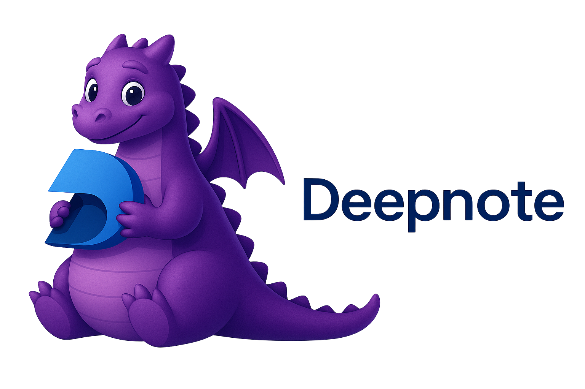

<div align="center">

[](https://github.com/deepnote/deepnote/actions/workflows/ci.yml)
[](https://codecov.io/gh/deepnote/deepnote)

[Website](https://deepnote.com) • [Docs](https://deepnote.com/docs) • [Blog](https://deepnote.com/blog) • [X](https://x.com/DeepnoteHQ) • [Examples](https://deepnote.com/explore) • [Community]()

</div>

---

## 🚀 Quick start

Get started with Deepnote in seconds:

```bash
# Install the converter
npm install -g @deepnote/convert

# Convert your Jupyter notebook
deepnote-convert notebook.ipynb --projectName "My Analysis"

# Or use it programmatically
npx @deepnote/convert notebook.ipynb
```

Then open your `.deepnote` file in [VS Code](https://marketplace.visualstudio.com/items?itemName=Deepnote.vscode-deepnotee), [Cursor](https://open-vsx.org/extension/Deepnote/vscode-deepnote), [Windsurf](https://marketplace.windsurf.com/vscode/item?itemName=Deepnote.vscode-deepnote), or [JupyterLab](https://github.com/deepnote/jupyterlab-deepnote)!

---

## 🌟 What is Deepnote?

Deepnote Open Source is an AI notebook, built with collaboration and the next decade in mind. It's pretty, AI-first, has countless data and ecosystem integrations, and offers you everything you'd need to work locally before you scale your workflows in a team with Deepnote Cloud.

### Why Deepnote Open Source?

🗂️ **_Human-readable format_** – The .deepnote YAML format replaces ipynb's messy JSON with clean, version-control and human-friendly structure for projects and notebooks. You can organize multiple notebooks, integrations, and settings into a single .deepnote project for better structure and collaboration.

🧩 **_Block-based architecture_** – Extend notebooks beyond code cells with blocks for SQL, inputs, charts, and much more — all defined and validated through the open @deepnote/blocks package.

🔁 **_Effortless conversion_** – Convert .ipynb notebooks into .deepnote projects and back again using the open @deepnote/convert CLI and API.

💻 **_Work wherever_** – Run notebooks locally in VS Code, JupyterLab, or anywhere else with the open-source Deepnote Toolkit. Once you want to work in a team on the same notebook with beefier compute - drag and drop your project into Deepnote Cloud.

⚡ **_Reactive notebook execution_** – Automatically re-runs dependent blocks when inputs or data change, ensuring notebooks stay consistent and reproducible without manual execution.

🌐 **_Open and extendable_** – Built on the Jupyter kernel for full compatibility with your existing notebooks, while offering a shared, upgraded open standard that contributors, IDE developers, and integrators can build upon.

## 🎯 What can you do right now?

This open-source repository lets you:

### 🖥️ **Use Deepnote in VS Code, Cursor, and Windsurf**

Edit and run Deepnote notebooks directly in your favorite AI-native code editors:

- 🖥️ **[VS Code extension](https://github.com/deepnote/vscode-deepnote)** - Full Deepnote support in Visual Studio Code
- ✏️ **[Cursor extension](https://github.com/deepnote/vscode-deepnote)** - AI-powered notebook editing in Cursor
- 🌊 **[Windsurf extension](https://github.com/deepnote/vscode-deepnote)** - Collaborative development in Windsurf

### 🧪 **Use Deepnote in JupyterLab**

- 🧪 **[JupyterLab extension](https://github.com/deepnote/jupyterlab-deepnote)** - Read `.deepnote` files in JupyterLab with backwards compatibility

### 🔄 **Convert Jupyter notebooks to Deepnote format**

```bash
npm install -g @deepnote/convert
deepnote-convert notebook.ipynb
```

### 📦 **Build with Deepnote's TypeScript SDK**

```typescript
import { createPythonCode, createMarkdown } from "@deepnote/blocks";
// Work with Deepnote blocks programmatically
```

---

## 📊 Deepnote vs. Others

### Deepnote vs. Jupyter

<details>
<summary>Deepnote keeps the same Jupyter core so you can seamlessly move between both, but adds an AI-first design, sleek UI, new blocks, data integrations—so you never have to maintain or rebuild these pieces yourself.</summary>

| Feature             | Deepnote                          | Jupyter                     |
| ------------------- | --------------------------------- | --------------------------- |
| **Setup**           | Zero setup, cloud-based           | Local installation required |
| **AI Features**     | Native AI Copilot                 | Third-party extensions      |
| **Version control** | Built-in Git integration          | Manual Git workflow         |
| **Sharing**         | Share with a link                 | Export files manually       |
| **Compute**         | Managed cloud compute             | Local resources only        |
| **Integrations**    | Native database & API connections | Manual configuration        |

</details>

### Deepnote vs. Marimo

<details>
<summary>Deepnote offers a rich integration ecosystem, works wherever you do and in any language (Python, R, SQL), and scales effortlessly to production grade workflows with Deepnote cloud used by 500,000+ data professionals, while Marimo remains a lightweight, single-user local notebook with limited community adoption.</summary>

| Feature                  | Deepnote                              | Marimo         |
| ------------------------ | ------------------------------------- | -------------- |
| **AI Integration**       | Built-in AI Copilot                   | No AI features |
| **Database Connections** | 60+ native integrations               | Manual setup   |
| **Deployment**           | One-click sharing & scheduling        | Local only     |
| **Language Support**     | Python, SQL, R                        | Python only    |
| **Editor Support**       | VS Code, Cursor, Windsurf, JupyterLab | Terminal-based |

</details>

## 🚀 What's inside this repository

### 📦 TypeScript packages

Reusable packages and libraries powering Deepnote's notebook, runtime, and collaboration features.

#### **[@deepnote/blocks](./packages/blocks)**

TypeScript types and utilities for working with Deepnote notebook blocks.

- **Block type definitions**: Code, SQL, Text, Markdown, Input, Visualization, Button, Big Number, Image, Separator
- **Python code generation**: Convert blocks to executable Python code
- **Markdown conversion**: Convert text blocks to/from markdown format
- **Input block support**: Text, textarea, checkbox, select, slider, file, date, and date-range inputs

```typescript
import { createPythonCode, createMarkdown } from "@deepnote/blocks";
```

#### **[@deepnote/convert](./packages/convert)**

CLI tool and library to convert Jupyter notebooks (`.ipynb`) to Deepnote format (`.deepnote`).

- **CLI tool**: `deepnote-convert` command for batch conversions
- **Programmatic API**: Use in Node.js/TypeScript applications
- **Directory support**: Convert entire folders of notebooks
- **Custom projects**: Set metadata during conversion

```bash
npm install -g @deepnote/convert
deepnote-convert notebook.ipynb --projectName "My Analysis"
```

### 🐍 Python packages

- **[deepnote-toolkit](https://github.com/deepnote/deepnote-toolkit)** - Python kernel extensions and integrations for Deepnote (separate repository)

## 🔜 Coming soon - local use

Soon you'll be able to clone the repo, install dependencies and run the dockerised Deepnote locally with no other setup required:

```bash
git clone https://github.com/deepnote/deepnote.git
cd deepnote
pnpm install
pnpm start
```

## 🎓 For students and academics

Deepnote is **free for students and educators**! Get unlimited access to all core features, cloud compute, and real-time collaboration for your research and teaching.

**Learn more:** [deepnote.com/education](https://deepnote.com/education)

---

## 🙌 Need help?

- 👥 Join our [Community]()!
- 💬 [Open an issue](https://github.com/deepnote/deepnote/issues/new) for bug reports or feature requests
- 📖 Check out our [documentation](https://deepnote.com/docs)
- 🌐 Visit [deepnote.com](https://deepnote.com) to try Deepnote

---

## 🛠️ Contributing

We love external contributors! Whether you're fixing bugs, adding features, or improving documentation, your contributions are welcome.

Please see [CONTRIBUTING.md](CONTRIBUTING.md) for:

- Development setup instructions
- Code style guidelines
- Testing requirements
- Pull request process

---

## 📄 License

This project is licensed under the **Apache License 2.0** - see the [LICENSE](LICENSE) file for details.

By contributing, you agree that your contributions will be licensed under the Apache 2.0 License.

---

## 🙌 Acknowledgements

We owe a huge thank-you to the Jupyter community and everyone who has contributed to open notebooks over the past decade. Jupyter set the standard for how the world explores data and shares ideas through code when it launched in 2013. Deepnote builds directly on that legacy — and extends it into the AI-native, collaborative future. None of this would exist without the foundations Jupyter created, and we’re proud to keep contributing back to the same open ecosystem.

---

<div align="center">

**Built with 💙 by the Deepnote team**

</div>
