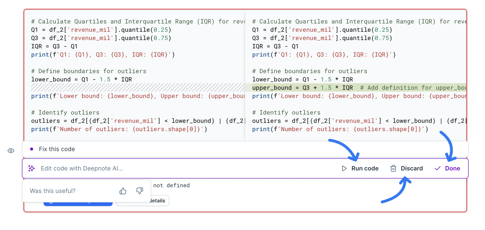

When running into an error, you'll find a **Fix with Deepnote AI** button appearing right beneath your error message, ready to come to your aid. After you click it, Deepnote AI swings into action, delivering a suggested fix for your code.

<VideoLoop src="https://raw.githubusercontent.com/deepnote/deepnote/main/assets/docs/j1KKoeM6QqIO02PSiEM3.mp4" />

The suggested code will be displayed side by side of the original code in a diff view so. Press the **Run code** button to see the effect of the changes. If you're satisfied with the fixed code, press **Done** to accept it. If the suggested code fix does not suit your needs, you can **Discard** it, returning to your previous code.

If you want to further edit the suggested fix, you can immediately type in a new prompt. Each prompt, including your follow-ups is added to the prompt edit history. If you wish to revert to a previous stage in your editing flow, you can simply click on the desired step from the list of your prompts, returning the block to that specific state.

<VideoLoop src="https://raw.githubusercontent.com/deepnote/deepnote/main/assets/docs/1SkHCdiRi6bridWa8i6A.mp4" />
