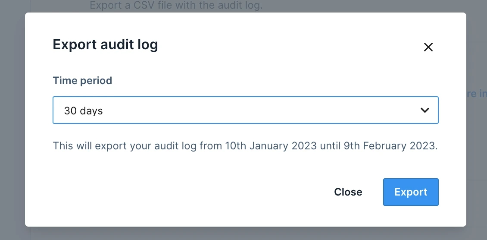
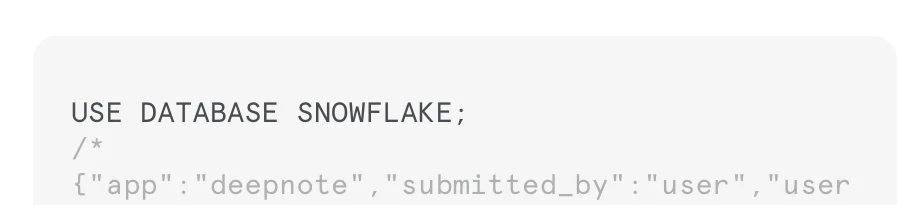

<Callout status="info">

This feature is available on the Enterprise plan.

</Callout>

Deepnote stores every user's action within a workspace, together with metadata associated with it. Workspace admins can export the audit log as a .csv file from the Settings & members > Security page Audit log section.

### SQL blocks audit log

When executing an [SQL block](/docs/sql-cells), Deepnote appends a SQL comment with metadata related to the context in which the query is executed. This helps administrators of a database to quickly understand when and by whom the query was executed. The metadata contains workspace, project and notebook ID, whether the query was executed by a user, scheduling or API, and a link to the project.

