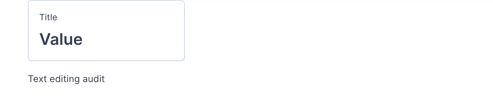

Bar charts and scatter plots are useful for exploring data. To highlight one metric in an app or dashboard, use a big number block.

You can add a big number block by pressing the **add block (+)** button between blocks and selecting the "Big number" option from the menu.

In the current UI, a new big number block shows **Title** and **Value** placeholders. The tested block did not expose controls for selecting a notebook variable, interpolating a Python variable in the title, formatting the value, or adding a comparison.

