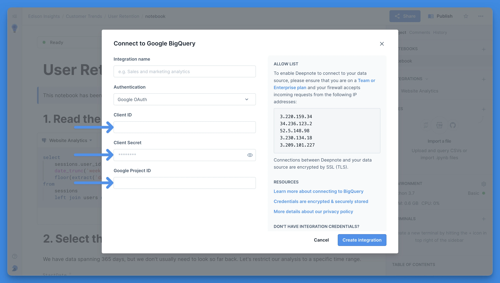
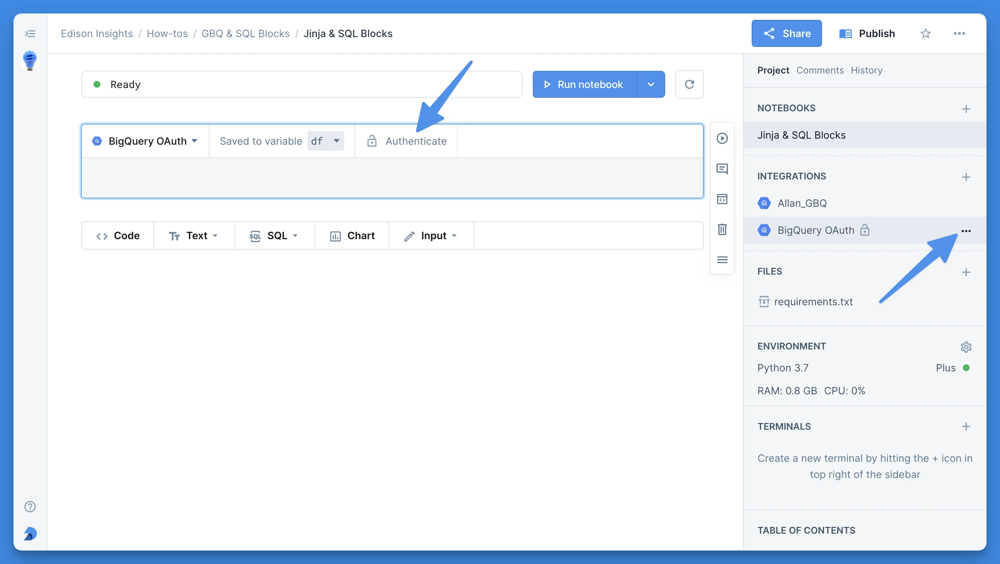

## What can you do with BigQuery's Google OAuth?

<Callout status="info">
Available on Enterprise plan
</Callout>

With BigQuery's Google OAuth authentication you can give every member of your Deepnote workspace their own set of credentials. This ensures greater security by using short-lived tokens and enabling the use of multi-factor authentication. Follow the principle of least privilege and use granular access control for various BigQuery resources to ensure users can only access the data they need.

### Setting up OAuth for BigQuery in Deepnote

To set up authentication to BigQuery via OAuth, navigate to the [Google Cloud console](https://console.cloud.google.com) and complete the following steps:

1. Click **API & Services** Section and select **Credentials** from the left side bar
2. Click **Create Credentials** and select **OAuth Client ID**
3. If this is the first one, you will need to **Configure Consent Screen** by following the steps. Pick options that make sense for your organization. If you are not sure, you can pick these:
   1. Select user type: **Internal**
   2. Set **Your company OAuth** as name, and add your own email as support email and developer contact information
   3. You do not need to add any scopes
   4. Click **Save and continue**, and return to creating credentials
4. For Application type, choose **Web Application**
5. Fill in the **Name** field, for example `Deepnote OAuth`
6. In Redirect URIs, click on Add URI and enter

   ```
   https://deepnote.com/auth/bigquery/google-oauth-callback
   ```

   as redirect URI

7. Click **Create**
8. From the newly created Client, copy `CLIENT_ID` and `CLIENT_SECRET`

👉 Now head back to Deepnote and add the Client ID, Client Secret, and Project ID to the Google Big Query integration pop up. You will of course need to make sure you've selected Google OAuth as the authentication method.


### Querying data with user-specific authentication

Since every user will have to authenticate using their own Google account with this method, the notebook provides a few ways to accomplish authentication (also see the image below). Any of the following actions will initiate authentication for a given user:

- Pressing the **Authenticate** button on a SQL block
- 2. Clicking **Authenticate integration** from three-dot menu of the integration in the right sidebar
- 3. Responding to a request for authentication when executing an SQL block



When you create an app from a notebook that uses the integration, every app user will need to authenticate with their own account. They will be prompted to sign in using Google during the execution of the app. The results they see will depend on the permissions they have.

<Callout status="info">
- User authentication is also required to browse the BigQuery schema.
- Scheduled notebooks can use a BigQuery OAuth integration: scheduled runs authenticate with the OAuth tokens of the user who set up the schedule. Because those tokens can expire or be revoked, scheduled runs may fail unexpectedly — for reliable scheduling, use [service account authentication](google-bigquery#authenticating-with-a-service-account) instead.
</Callout>

### Running notebooks locally with the Deepnote CLI

The Deepnote CLI (`npm install -g @deepnote/cli`) can run notebooks that query a BigQuery integration using Google OAuth on your own machine. It uses the OAuth client you set up above, so no additional redirect URI is needed.

1. Make sure the integration is in your local integrations file, for example by running `deepnote integrations pull`. If it isn't, the CLI looks it up in your workspace using your `DEEPNOTE_TOKEN`.
2. Run `deepnote integrations auth <integration-id>`. The CLI opens Google's consent screen in your browser; if you aren't signed in to Deepnote there, you'll be asked to sign in first. Once you approve, the CLI stores a refresh token for the integration under `~/.deepnote/federated-auth-tokens/`.
3. Run your notebook with `deepnote run`. Before any block executes, the CLI exchanges the stored refresh token for a fresh access token.

<Callout status="info">
- Sign-in has to finish in a browser on the same machine as the CLI, so it doesn't work over SSH or in CI. For automated runs, use [service account authentication](google-bigquery#authenticating-with-a-service-account).
- The access token lasts about an hour and isn't renewed during a run, so SQL blocks in a longer run can fail.
- If you change the integration's Client ID, Client Secret, or Project ID, or revoke its access in your Google account, `deepnote run` stops and asks you to run `deepnote integrations auth` again.
</Callout>
