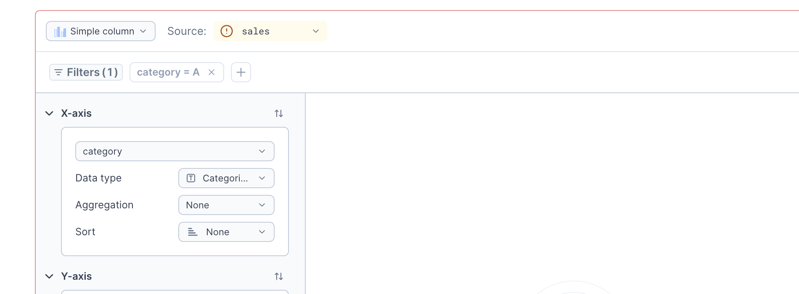

Chart blocks allow you to create charts from pandas, Polars, and PySpark DataFrames without code. They are useful for fast exploratory analysis and for people who are not familiar with making charts with Python code.

To get started, you can watch our quick demo on chart block configuration.

<Embed url='https://www.loom.com/share/6a6f531acf514df88da25656e144e78e'/>

<Callout status="info">

For practical examples of how to use charts for exploratory analysis, check out this [notebook](https://deepnote.com/workspace/deepnote-8b0ebf6d-5672-4a8b-a488-2dd220383dd3/project/Showcase-fbb28234-0514-42c2-965a-85ce2cdec982/notebook/Notebook%201-17cb089a528f488ab2931c4ac944790a).

</Callout>

## Adding a chart block

<VideoLoop src="../assets/docs/zfPIemgaSuerKkxnvbVL.mp4" />

You can add a chart block to your notebook by clicking on the **Visualize** button in the upper right corner of a Dataframe output table.

Alternatively, you can also add a chart block by pressing the **Add block (+)** button in between blocks and selecting the **Chart** option from the menu.

## Setting up the data

<VideoLoop src="../assets/docs/CQysjgaRWfuPpuRfg6sA.mp4" />

To start, select a DataFrame to visualize in the upper left corner. By default, your chart is a simple column chart. To switch to another type, such as a line chart or scatter plot, use the dropdown in the top left corner.

Once you picked a DataFrame, you need to configure which data to display on the chart. Depending on selected chart type this can be either X/Y axes or segment's color and size for circular charts. Both can be adjusted from the first two sections of the sidebar. Just select a column you want to visualize and adjust settings if needed (we'll go over those in a minute).

In this doc, we'll refer to these settings as dimension and measure. Dimension describes the categories in your chart. For example, in a "Monthly revenue" column chart, the dimension is "monthly" and appears on the X-axis. Dimension settings are always in the first section of the sidebar. A measure is a quantitative value that you want to analyze or summarize. In the previous example, the measure is "revenue" and it appears on the Y-axis.

Dimension and measure can correspond to different axes, depending on chart type. For example, in column chart dimension is X axis and measure is Y axis. But they are swapped in bar chart. In pie and donut charts, dimension is color of the segment, while measure is its size.

## Adjusting how data is interpreted

Depending on the chart type and data type, there are a couple of additional settings that change how data is interpreted and charted. You'll find these settings next to the column dropdown.

### Data type

Depending on the chart type, you might be able to manually change the data type of selected column. Deepnote supports 3 data types.

- Nominal - categorical data without a specific order among values. For example, product categories in a sales report.

- Temporal - data related to time and dates. In the sales report example, order date has a temporal data type.

- Quantitative - numerical data that can be measured and analyzed mathematically, such as product prices or store revenue.

### Aggregation

Quantitative and nominal fields can have an aggregation. Aggregation allows us to combine multiple records into single summary value.

Nominal fields support two aggregations: `count`, which reduces a set of records to a single number representing their count, and `distinct`, which returns the number of unique values in the selected column among matching records.

But aggregations really shine with quantitative fields. In addition to `count` and `distinct` you can calculate `sum`, `min`, `max`, `average`, and `median`.

### Binning

In addition to aggregation, it's possible to bin quantitative dimension field into set number of ranges. Those ranges work as categories for data, so you can, for example, chart average customer satisfaction score depending on their age group.

### Time resolution

For temporal fields you can select how precise you want your chart to be. All records will be grouped by selected field into groups depending on the selected resolution. For example, setting resolution to "Year, month" allows you to analyze monthly revenue over time. Or you could set it to "Week" to analyze seasonality of sales across multiple years.

## Group by

Grouping allows you to add another dimension to your chart. But instead of making it 3D and hard to read, it adds color. To add grouping to series click **+ Group by** and select column which should be used for grouping. Don't see it? That means selected chart type doesn't support grouping, try another chart type.

Results vary depending on the selected chart type and the data type of the column used for grouping. Grouping by a nominal column splits the chart into multiple elements, one for each value of the grouping column. If you select a stacked chart type, those elements are stacked on top of one another. Otherwise, they are displayed side by side. Grouping by a nominal field lets you see monthly revenue for each store location instead of a single total value.

Grouping by quantitative field with applied aggregation will change color of the element depending on the value of the column. For example, if you have "Sales by location" chart, you can add grouping by average value of order.

To change color palette you can click on color/palette badge next to the series name and select one from the built-in palettes.

<VideoLoop src="../assets/docs/HOHBGWkRHC812iq2GNmC.mp4" />

## Filtering

You can slice and dice your data right from the charts with interactive filtering.
Select data points to filter in/out in one of two ways.

- Highlight a range of data points with mouse-select.
- Click on individual legend entries of grouped series.

Once you selected some data, press the **Keep only** or **Exclude** buttons to filter in/out the selected data points on your chart. You can also combine multiple filtering steps to drill down even further.

<VideoLoop src="../assets/docs/KC6hlTXPTCuIlpiWdNQV.mp4" />

You can also apply **conditional filters** on your charts, giving you more precision and the ability to apply more complex filtering logic. Click the **Filter** button in the chart controls, select the column you want to filter, choose an operator and a value, and press **Apply**.

<VideoLoop src="../assets/docs/p7WogC9QmqIYj1exF9VQ.mp4" />

Applied filters are added to the Filters list, making them easy to remove or modify. To combine multiple conditional filters, press the plus button in the Filters list.

<VideoLoop src="../assets/docs/oQd8gnR22ohfu3Q2hBqw.mp4" />

Conditional filters are also available in Apps! By utilizing filters, your audience can easily slice and dice the plotted data themselves, enabling them to focus on particular aspects of interest. This greatly extends the self-serve capability of your Apps, making them more dynamic and eliminating the need to anticipate all filtering needs in advance.

<VideoLoop src="../assets/docs/zfPIemgaSuerKkxnvbVL.mp4" />

## Combo charts

Sometimes, one series is simply not enough. Like peanut butter with jelly, some visualizations are miles better when combined. In Deepnote you can add multiple series to your charts, use dual axis, and switch series type.

To add new series, click **+ Add series**. Some chart types (like donut or histogram) don't support multiple series, so if you don't see the button try changing the chart type in the top left corner.

In addition to all the usual series settings, you can switch series type. Click on the icon right to the column dropdown and select one of compatible chart types. Additional series can be switched to use secondary measure axis by changing **Axis** settings. This is very handy to show correlation between series with values of different magnitudes.

<VideoLoop src="../assets/docs/giLHonoFTyiZEhE8liU8.mp4" />

## Custom tooltips

Ever needed to show a bit more information on a chart without cluttering the entire visualization? With custom tooltips, you can select additional columns from your plotted DataFrame to display in the tooltip, not just those configured on the chart.

It’s perfect for highlighting more information for an unusual data point on a scatterplot or adding context with an extra metric on your bar charts, all without overwhelming your audience.

Simply go to the **Tooltip** section and select which column you'd like to display.

## Visual settings

With main data-related settings covered, let's go over how you can adjust look and feel of your chart.

### Titles

You can change chart title, as well as axis titles (if applicable) in the **Titles** section (no surprises here) of the sidebar. For axis titles you can also hide them completely, or, if you leave them empty, default value will be used.

### Value labels

In the **Value labels** section you can enable displaying value labels for a series. Value labels can be displayed as numbers, percentages, or in scientific notation. You can also control number of decimals.

For pie, donut, and normalized chart types it's possible to switch from displaying of absolute values to percentages of total. This is controlled by **Show as** setting in the Value labels section.

For pie and donut charts you can also select if you want to display value labels inside or outside of the chart.

In the **Style** section you can set formatting for labels on quantitative axes.

<VideoLoop src="../assets/docs/sraOXSaDSMq80vG3ZOD0.mp4" />

### Resizing charts

Once you’ve finalized your chart, you can collapse the configuration sidebar to make the chart fill out the whole block. If you wish to present charts on larger displays, you can switch to full-width mode for your notebook. You can also vertically resize the chart by dragging the resize handle at the bottom of the chart canvas.

<VideoLoop src="../assets/docs/OKU5JTVwSzadIOqC8BUs.mp4" />

## Customize charts with code

If you need more flexibility to customize your charts, open the **block actions** menu and select **Duplicate as code**.

This adds a new Python code block containing your chart configuration in the [Vega-Lite](https://vega.github.io/vega-lite/) specification format. Vega-Lite is powerful and fairly easy to learn, so it is a good option for finely customized or advanced visualizations.

<VideoLoop src="../assets/docs/GGVOfg2mSISnWCjbp6jy.mp4" />

## Limitations

You can chart DataFrames of all shapes and sizes. Deepnote does not limit the number of rows. As long as the DataFrame fits in machine memory, it will be charted.

However, we apply a limit of 5,000 data points post-aggregations. In cases when a DataFrame exceeds 5,000 rows after applying aggregations, Deepnote will display only the first 5,000 data points.

For example, imagine you're preparing a yearly sales report. You have DataFrames with all orders from last year, it contains 1,000,000 orders (sales were good last year!), and you want to chart the number of sales per each month. In this case your whole dataset will be aggregated to just 12 data points, and Deepnote will happily chart that for you.

In another chart, you might want to show the correlation between customer age and how much they spent last year. You have a DataFrame with 50,000 users and their spending last year, and you intend to use a scatter plot to show this data. Since there is no aggregation, this produces a chart with 50,000 data points. Rendering this many data points can cause browser performance issues and make the chart hard to use. Deepnote renders only the first 5,000 data points to avoid this.

When charting a PySpark DataFrame, aggregations run across your full Spark cluster with no sampling, so the resulting chart reflects the entire dataset rather than a preview.

Don't really want all those dimensions, measures, series? Just want to show important metrics in your app? Check out our [Big number](big-number-blocks) block! It looks excellent on dashboards.
