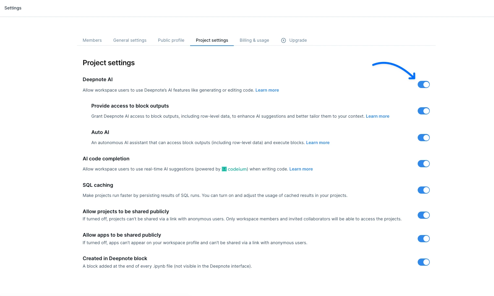
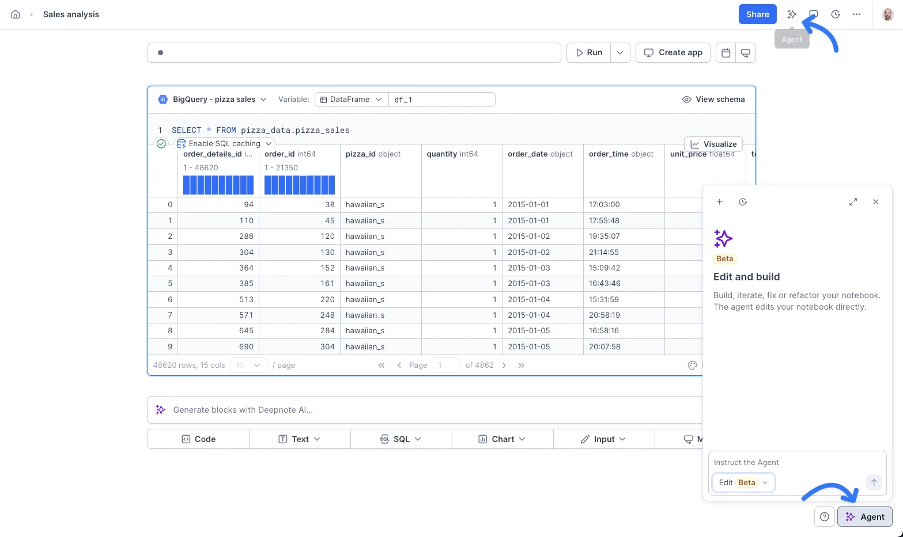
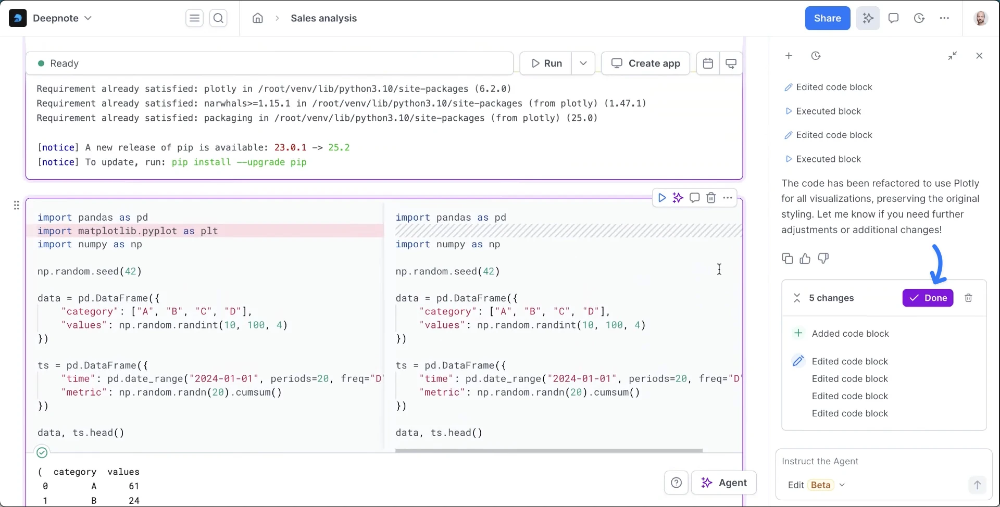
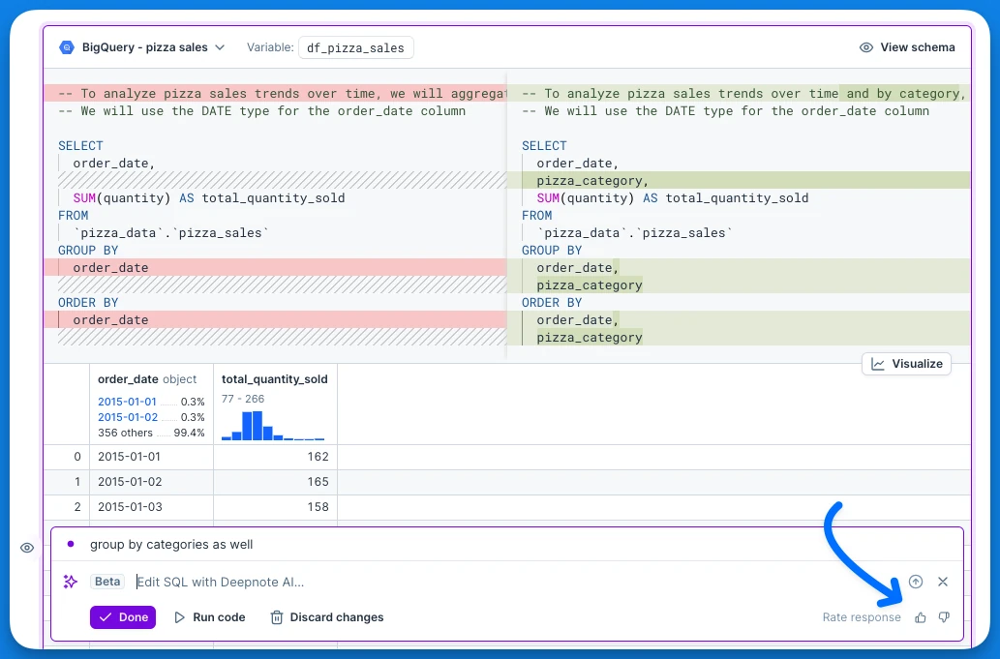

Deepnote Agent helps you generate, edit, explain, and complete code. It can also make changes across your notebook, run blocks, and inspect results.

<Callout status="info">
Deepnote Agent is available on Free, Team, and Enterprise plans. Free includes limited requests. See [Pricing](https://deepnote.com/pricing) for current limits.
</Callout>

<Callout status="warning">
AI-generated code and text can contain errors or inaccuracies. Review suggestions before running them.
</Callout>

## Enable Agent

If Agent is disabled in your workspace, ask an admin to turn on **Deepnote Agent** in **Settings & members** → **AI**. Admins can use **Provide access to block outputs** to choose whether Agent can read block outputs, including row-level data. For details about data shared with AI providers such as Anthropic and OpenAI, see [Data privacy](/docs/ai-data-privacy).

## Open Agent

Agent can create, edit, and remove blocks across your notebook. In Edit mode, it can also run code, inspect outputs, and adjust its work based on the results.

Open Agent from the **Agent button** in the project top bar or the **Agent button** in the notebook toolbar. You can use the full sidebar, minimize the chat to a smaller window, or hide it.

<Embed url='https://www.loom.com/share/ecdb03ba6ae34a10acc2f23e1383c441?sid=ed3de2f5-746b-4fa7-a62f-29132b351796'/>

## Use Agent

Choose a mode in the chat input:

- **Edit** lets Agent change notebook content, run blocks, and inspect results.
- **Ask** lets you discuss your data or Deepnote features without changing the notebook.

You can ask Agent to fix one block or work across the notebook. For tasks that need several steps, Agent may show a plan. As it works, the chat shows its actions, and you can select an action to jump to the relevant block.

When Agent finishes, it shows a summary and a list of changes. Code edits can include a before-and-after diff. Use the bin icon on a run to discard its changes, or send a follow-up request to continue working.

<VideoLoop src="../assets/docs/AaDC4FvhQQq2MDrtSUqtMz-cmetyt3d7xbfk07k60puolljn.mp4" />

Deepnote supports models from providers such as Anthropic and OpenAI. Where a model selector is available, you can choose a model or select **Automatic**. Agent can also use your connected [Deepnote MCP](/docs/deepnote-mcp) integrations and access Deepnote's documentation.

## Generate, edit, and explain code

Use the prompt bar below your notebook to generate blocks. To work on an existing code or SQL block, open its menu and select **Open Deepnote AI**. You can request an edit or an explanation, review the result, and accept or discard suggested changes.

Learn more about [generating code](/docs/ai-analysis), [editing code](/docs/ai-code-editing), [explaining code](/docs/ai-explaining-code), and [code completion](/docs/ai-code-completion).

## Feedback

Use the thumbs-up or thumbs-down controls on an Agent response or an inline suggestion to rate it. A downvote may give you a chance to add details. You can also share ideas on the [Product Portal](https://portal.productboard.com/deepnote/1-deepnote-product-portal/c/110-deepnote-ai?utm_medium=social&utm_source=portal_share).

