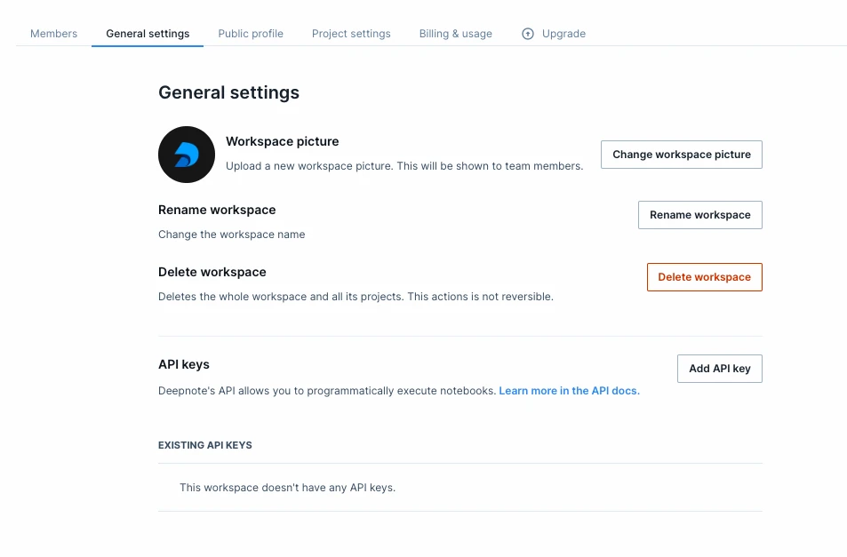

<Callout status="info">
The API is available on Team and Enterprise plans.
</Callout>

The Deepnote API provides you with an endpoint to programmatically execute an existing notebook. This enables various automation use cases from customized scheduling to integrating notebooks deeper into your workflows together with other applications.

## Authorization

To use the API, first you need to create an API key in your workspace's Settings & members > Security > API keys.



After creating your API key, you can use it to post requests to the Deepnote API. To use it, send it as bearer token in the `Authorization` header of your requests.

```
Authorization: Bearer INSERT_API_KEY
```
