## **Connecting to your data**

Deepnote integrates with all major data warehouses and databases, as well as common file storage services. Dropping a CSV straight into the notebook also works like a charm.

### Working with a CSV

To work with a CSV, simply drag it onto the notebook.

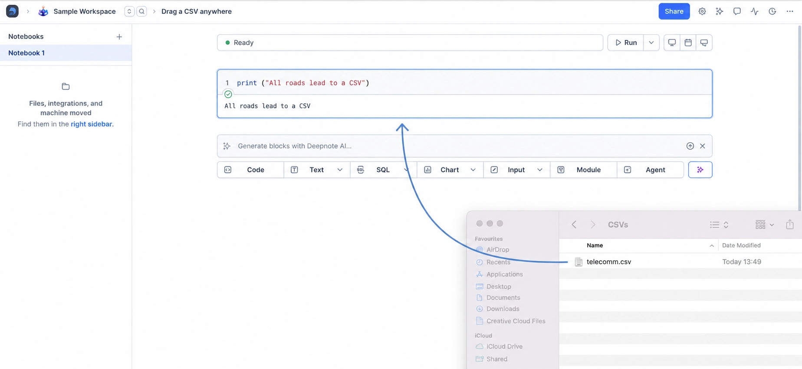

An SQL block with a sample query will be created for you and the file will be uploaded to Deepnote's file system. The results are saved to a Pandas DataFrame.

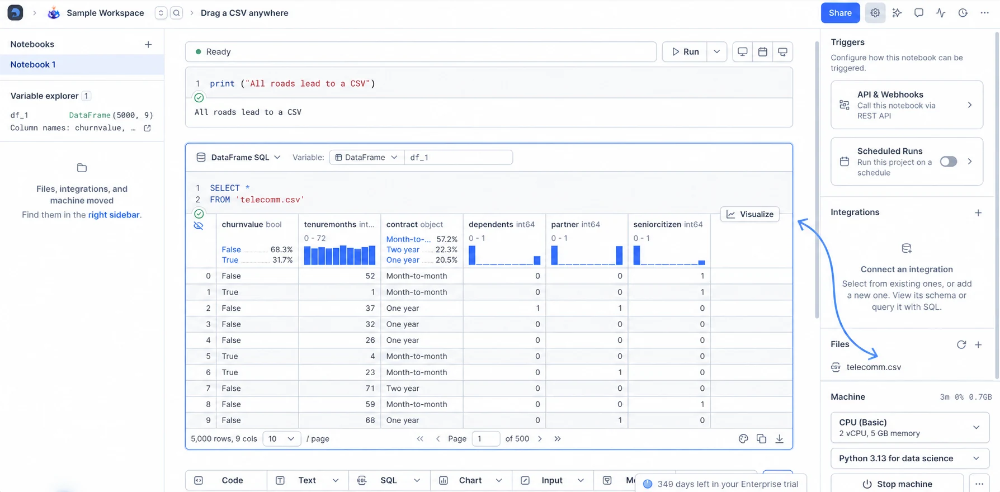

Pandas can also be used to read the uploaded CSV into the notebook's memory.

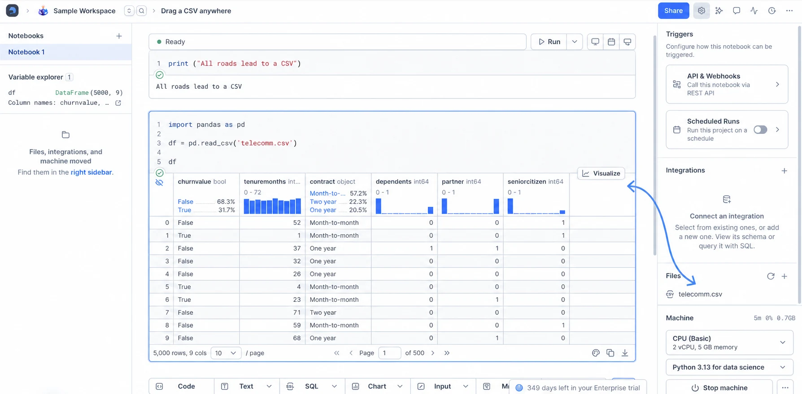

### Connecting to a database

In the notebook's right sidebar, click the **+** button next to **Integrations**.

Choose the database integration you want (e.g., Snowflake, BigQuery, PostgreSQL). You'll be asked to add your credentials.

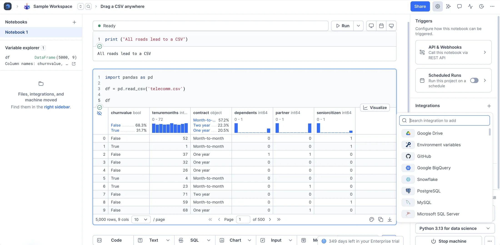

Once you've connected the database to a project (It'll appear in your sidebar), you can click it to preview its schema and use SQL blocks to query your data. The results are saved to a Pandas DataFrame.

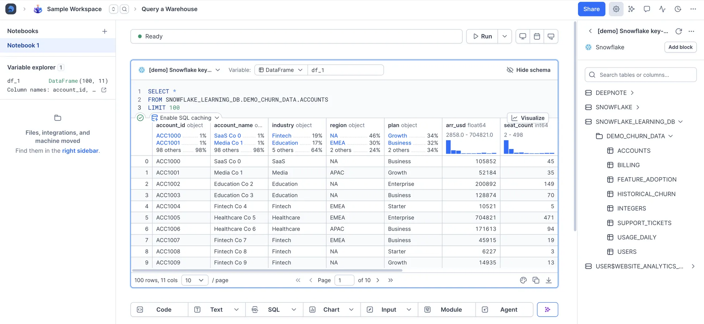

## Inviting your team members

It's dangerous to go alone. Take this link.

### Links, email invites, and business domains

From the **Settings & members** section in the left-hand panel, you'll find links that you can send to your team in order to invite them to the workspace.

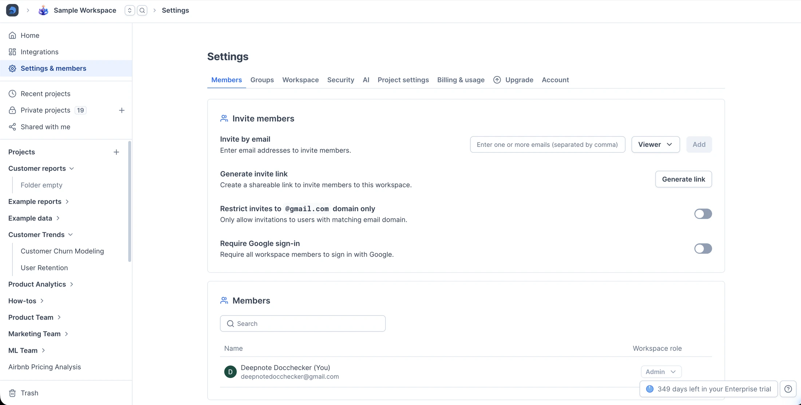

Different links provide different access controls.

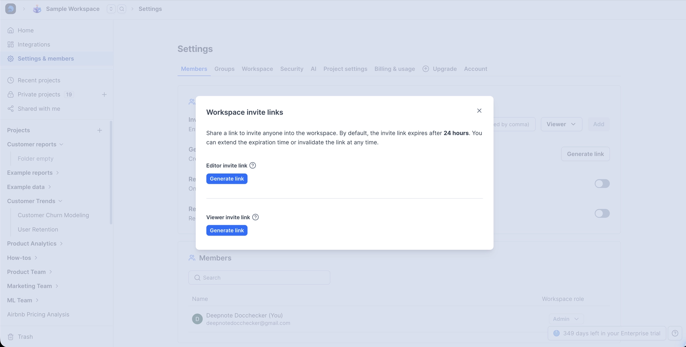

Alternatively, you may enter email addresses and assign access controls that way (note the toggle switch that allows anyone with your business domain to join the workspace).

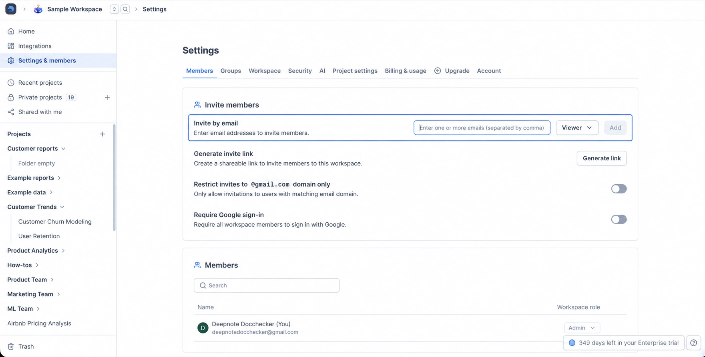

## Analyzing your data

Deepnote is a fully collaborative SQL and Python environment with a suite of no-code tools to help you move fast.

### SQL blocks

Create an SQL block and write native SQL queries against your CSVs and databases. Mix in Python to get the best of both languages. Results are saved to a Pandas DataFrame (am I repeating myself?).

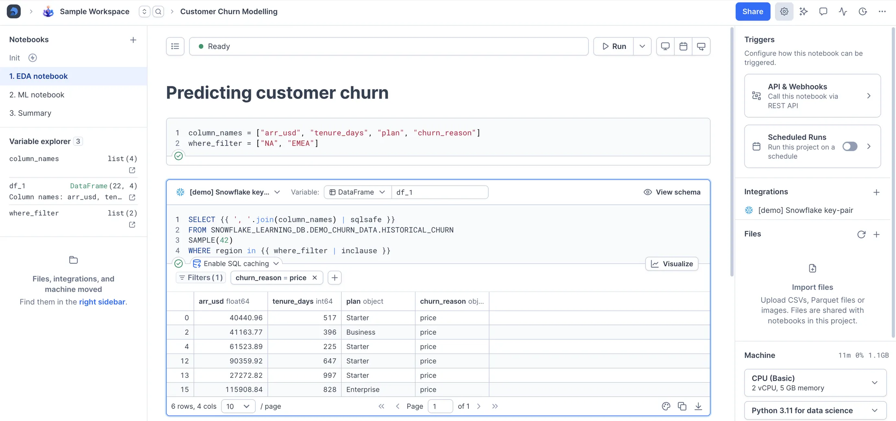

### Python blocks

You probably expected Python blocks, but there's more to it than that. Use the preinstalled libraries, `pip install,` whatever you want — you can even define your environment with Docker.

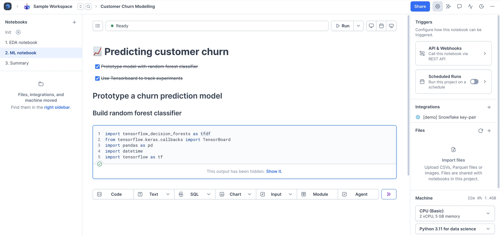

### Moving fast with no-code tools

Visualize any Pandas DataFrame with [chart blocks](https://deepnote.com/docs/chart-blocks).

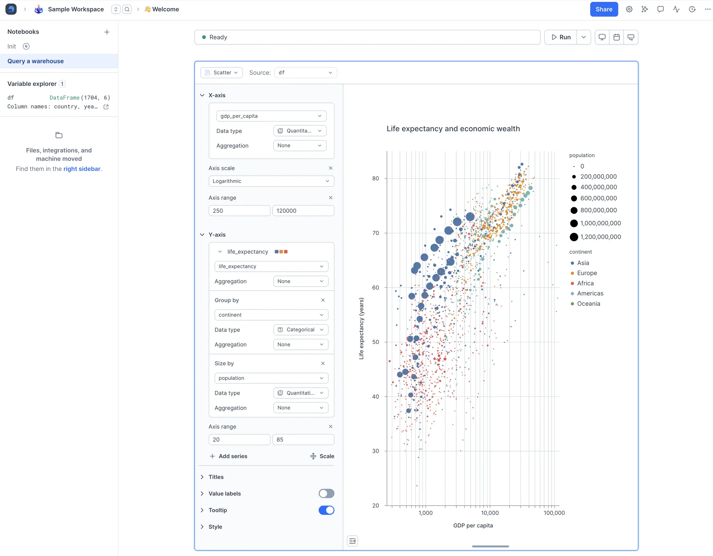

Parameterize your notebook with [input blocks](https://deepnote.com/docs/input-blocks).

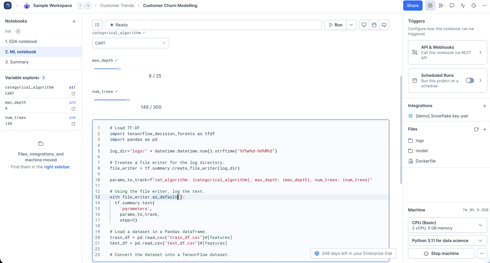

Communicate with [rich text blocks](https://deepnote.com/docs/text-editing).

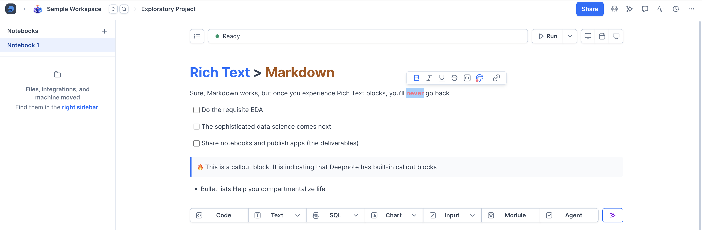
