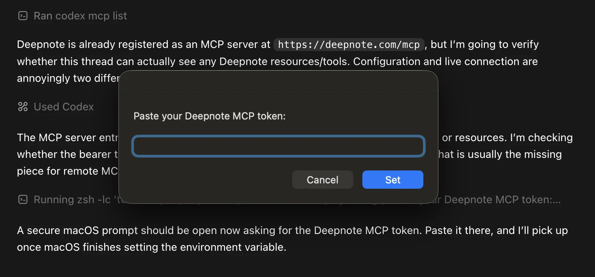
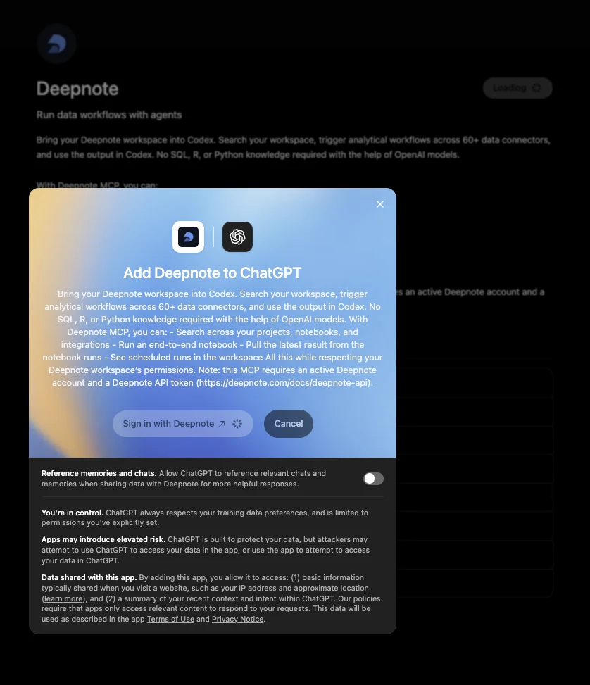
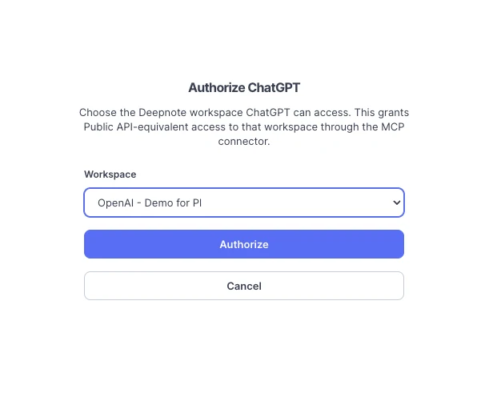
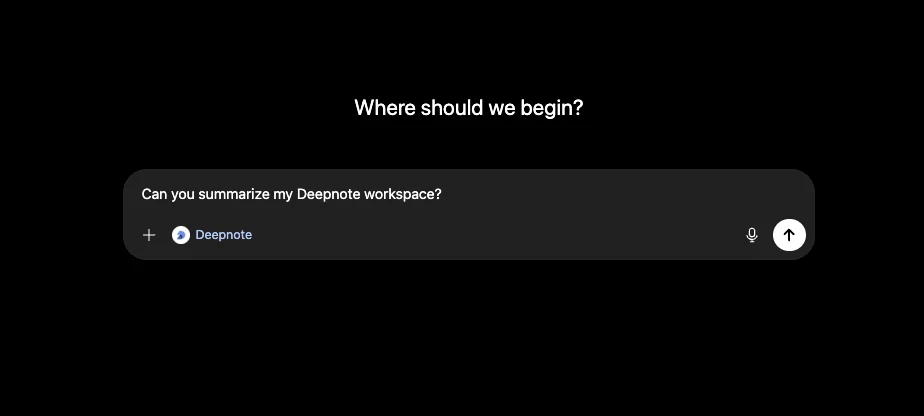

## What is Deepnote MCP?

The **Deepnote MCP server** exposes your Deepnote workspace to AI agents through the Model Context Protocol (MCP), an open standard for connecting LLMs to external tools and data.

Once connected, agentic harnesses and IDEs such as Codex, Claude, Cursor, VS Code, or any MCP-compatible client can explore your projects, read, create, edit, and run notebooks, inspect your data integrations, and search Deepnote's documentation within your existing permissions.

This means you can ask your assistant to "create a notebook in my analytics project and add a SQL block that queries last month's revenue", and it will use the Deepnote MCP tools to carry out each step.

The MCP server uses the same workspace API keys as the [Deepnote API](/docs/deepnote-api).

## Deepnote MCP Endpoint

The Deepnote MCP speaks the standard MCP protocol over HTTP `POST`, so any compliant client can connect.

```text
https://deepnote.com/mcp
```

## Authentication

Every request to the MCP server must be authenticated. There are two supported methods.

### API key

Create an API key in your workspace under **Settings & members > Security > API keys**, then configure your MCP client to send it as a bearer token:

```
Authorization: Bearer YOUR_API_KEY
```

### OAuth 2.0

Clients that support remote MCP servers with OAuth (for example Claude and Cursor) can connect without manually copying a key. Please point the client at `https://deepnote.com/mcp` and it will discover the authorization server automatically and walk you through an in-browser sign-in.

## Available tools

The server exposes the following tools. Read-only tools never modify your workspace; write tools require an API key or account with edit access.

### Account and workspace

- `get_me`: Return info about the authenticated individual: the workspace, the access level (viewer, editor, admin), etc.
- `search`: Search workspace resources across projects, notebooks, blocks, and integrations.
- `list_projects`: List workspace projects.
- `create_project`: Create a new project.

### Notebooks and blocks

- `get_notebook`: Get notebook details, including its blocks and input variables.
- `create_notebook`: Create an empty notebook inside a project.
- `create_block`: Create a new block (SQL, Python, text, etc.) in a notebook.
- `update_block`: Update the contents of an existing block.
- `reorder_notebook_blocks`: Move one or more blocks to a new position within a notebook.

### Running notebooks

- `create_run`: Start running a notebook and return the created run.
- `get_run`: Get a notebook run. Returns a presigned snapshot download URL when available, or optionally the inline snapshot content.
- `list_notebook_runs`: List historical runs for a notebook.

### Integrations

- `list_integrations`: List workspace integrations, optionally filtered by name or type.
- `get_integration`: Get integration details and its cached table structure.
- `list_integration_project_usages`: List projects connected to an integration.
- `list_integration_notebook_usages`: List notebooks that contain SQL blocks using an integration.
- `list_integration_block_usages`: List SQL blocks that use an integration.

### Documentation

- `list_docs`: Return the Deepnote docs navigation tree so the assistant can find the right article.
- `get_doc`: Fetch the full Markdown body of a documentation article by slug.

## Connecting a client

The examples below assume you have created a workspace API key under **Settings & members > Security > API keys**.

### Connecting Claude Code / Claude Cowork to Deepnote via UI

**Add it as a custom connector in the UI**

1. Open **Settings → Connectors.**
2. Click **Add custom connector**.
3. Name: `Deepnote`, URL: `https://deepnote.com/mcp`.
4. Save, then complete the **OAuth sign-in** when prompted.
5. It will then appear in `/mcp`.

### Connecting to Codex

Codex provides a data analytics plugin that packages connectors for data tools like Deepnote along with workflows that allow users to more easily diagnose metric movements, answer product and business questions, and create documents and reports.

Thanks to the Deepnote connector, teams can bring trusted business context from the tools they already use into data analytics workflows in Codex.

To connect Deepnote to Codex, the easiest way is to request a connection via ‘connect to deepnote mcp via [https://deepnote.com/mcp](https://deepnote.com/mcp)’. Codex will surface a UI for you to paste your Deepnote MCP token.



### Claude Desktop / Cursor (JSON config)

If your client uses JSON MCP configuration, add Deepnote as a remote server:

```json
{
  "mcpServers": {
    "deepnote": {
      "url": "https://deepnote.com/mcp",
      "headers": {
        "Authorization": "Bearer YOUR_API_KEY"
      }
    }
  }
}
```

Save the configuration and restart the client. The Deepnote tools should appear in the MCP tool list.

### Connecting Deepnote in ChatGPT UI

While Codex is the recommended OpenAI route when you want the [corresponding plugin for a data-analysis workflow](https://github.com/openai/plugins/tree/main/plugins/deepnote), [Deepnote can also be connected directly in the ChatGPT web app.](https://chatgpt.com/apps/deepnote/asdk_app_69fb51f9519081919c1f3e44ea9a5a05)

1. Open the Deepnote app in ChatGPT.
2. Select **Sign in with Deepnote**.



_Figure 1. Review the Deepnote app permission dialog, then select **Sign in with Deepnote**._

3. Choose the Deepnote workspace ChatGPT may access.

4. Select **Authorize**.

<div align="center">
  
</div>

_Figure 2. Choose the Deepnote workspace ChatGPT may access, then select **Authorize**._

5. Start with a prompt that confirms workspace access.



_Figure 3. Send a starter prompt such as “Can you summarize my Deepnote workspace?” to confirm that the connection is working._

## Verify the connection

Call the MCP server directly with curl to list the tools exposed to your authenticated identity:

```bash
curl -s https://deepnote.com/mcp \
  -X POST \
  -H "Authorization: Bearer YOUR_API_KEY" \
  -H "Content-Type: application/json" \
  -H "Accept: application/json" \
  -d '{
    "jsonrpc": "2.0",
    "id": 1,
    "method": "tools/list"
  }'
```

### Prompt-driven workflows

Because the assistant can chain tools together, a single natural-language request can drive a multi-step workflow. A few examples and the tools they trigger:

- **Build an analysis:** “Create a project called NASDAQ vs S&P 100, exploring stock returns for the past two years.” → `create_project` → `create_notebook` → `create_block`
- **Run and inspect:** “Run the Monthly KPIs notebook and tell me what changed.” → `create_run` → `get_run`
- **Audit integration usage:** “Which notebooks query our Snowflake warehouse?” → `list_integrations` → `list_integration_notebook_usages`
- **Tidy a notebook:** “Move the imports block to the top and replace the empty scratch block with a note.” → `get_notebook` → `reorder_notebook_blocks` → `update_block`
- **Answer product questions:** “How do I schedule a notebook?” → `list_docs` → `get_doc`

## Security and permissions

- All access is mediated by your workspace API keys or OAuth grants — the server can only see and do what the authenticating identity is allowed to.
- Revoking an API key (Settings & members > Security > API keys) or an OAuth grant immediately cuts off the connected client.
- Tools are annotated as read-only or state-changing so well-behaved clients can warn you before making changes.

## Related

- [Deepnote API](/docs/deepnote-api) — run notebooks programmatically over REST.
- [Deepnote Agent](/docs/deepnote-agent) — Deepnote's built-in AI collaborator inside the notebook.
- [Deepnote plugin in Codex](https://chatgpt.com/plugins/share/449d4e5659914849bfdf87e5c6d51960)
- [OpenAI launch post](https://openai.com/index/codex-for-every-role-tool-workflow/)
- [openai/plugins](https://github.com/openai/plugins)
