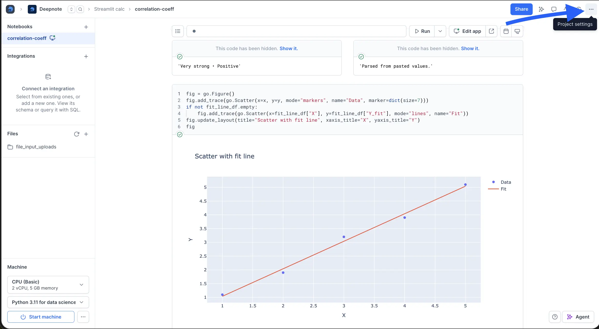
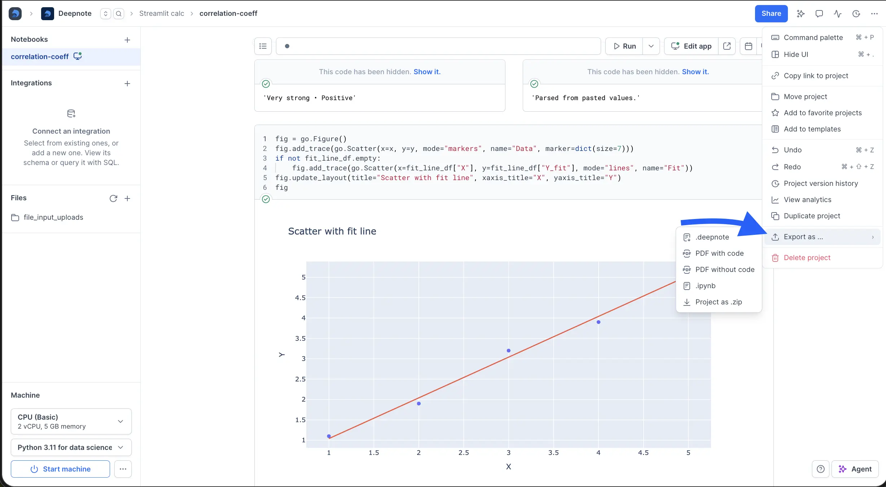
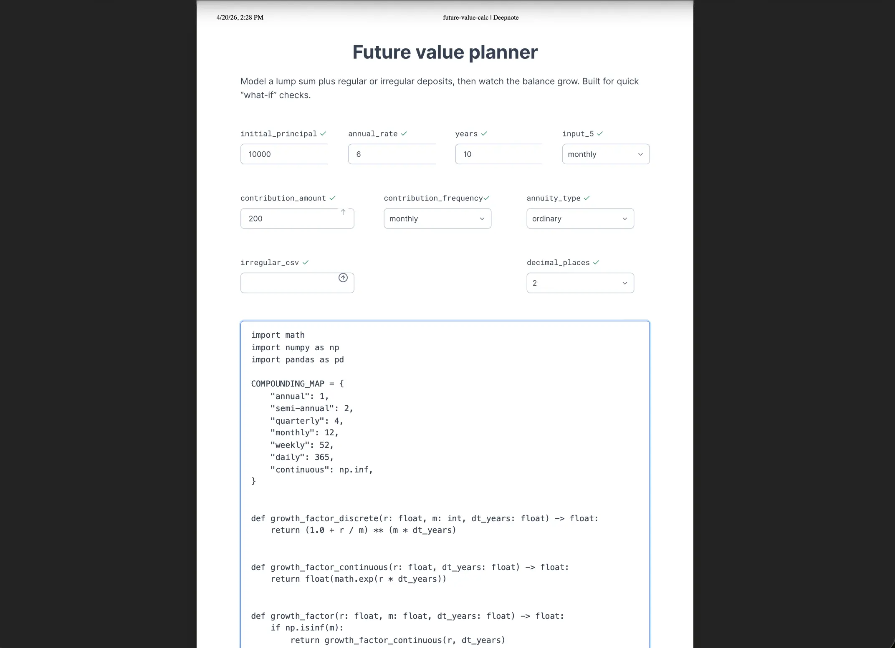
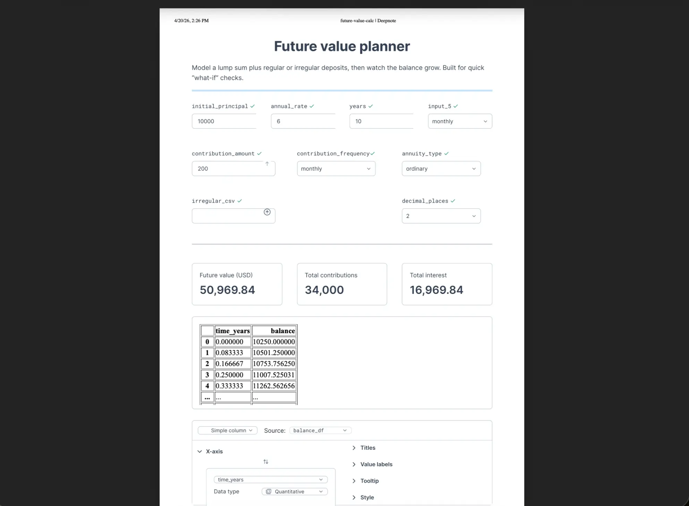

You can export a notebook to PDF directly from the project toolbar in just a few clicks.

1. Open the notebook you want to export.
2. Click the three-dot menu in the project toolbar.

3. Hover over **Export as**.
4. Choose **PDF with code** or **PDF without code**.

- **PDF with code** includes code cells in the exported PDF.

  

- **PDF without code** excludes code cells from the exported PDF.

  
