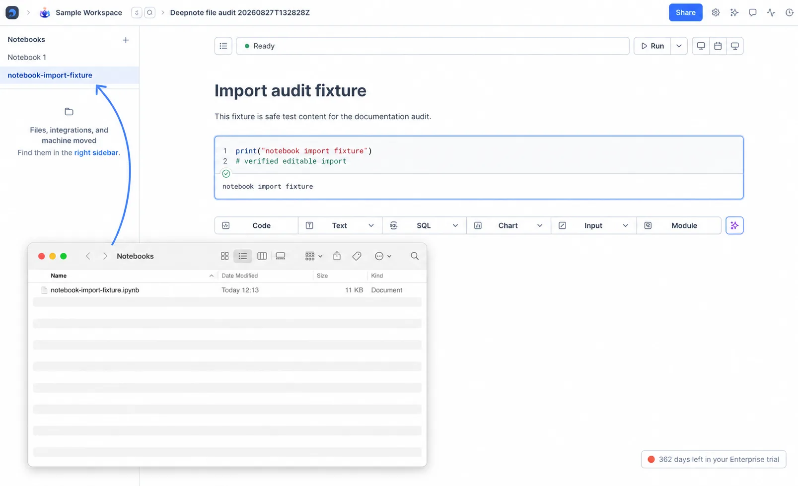
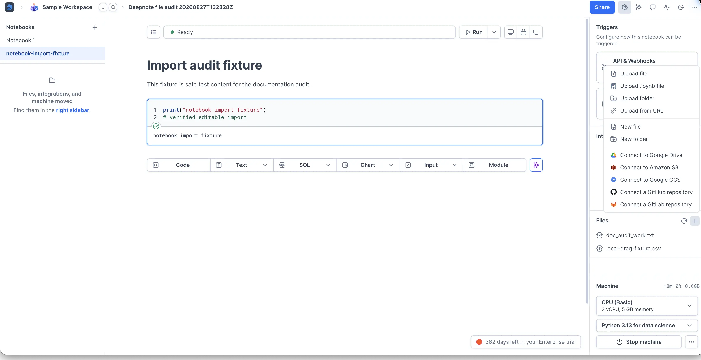

## How to import `.ipynb` files

There are two ways to import `.ipynb` files into a Deepnote project:

1. Drag and drop `.ipynb` files into the **NOTEBOOKS** section in the left panel.

    

2.1 In the right sidebar, click the **+** button in the **Files** section and select **Upload .ipynb file**.

2.2 After uploading the file, open it and select **Move to notebooks**. The file appears in the **Notebooks** section, where you can open it and start working.

    

## How to export `.ipynb` files

In the left panel's **Notebooks** section, open the notebook's actions menu, choose **Export as ...**, then select **.ipynb**.

Need a different output format? You can also convert [Jupyter notebooks to PDF](https://deepnote.com/ipynb-to-pdf) when you want a readable document to share with stakeholders who don't need to run the code.

<Callout status="info">

While we do our best to maintain compatibility with Jupyter, specialized blocks in Deepnote cannot be represented exactly in Jupyter (e.g., SQL, chart, input, and rich text blocks). Upon export, queries in SQL blocks will be converted to a string representation and rich text blocks will be converted to Markdown.

</Callout>
