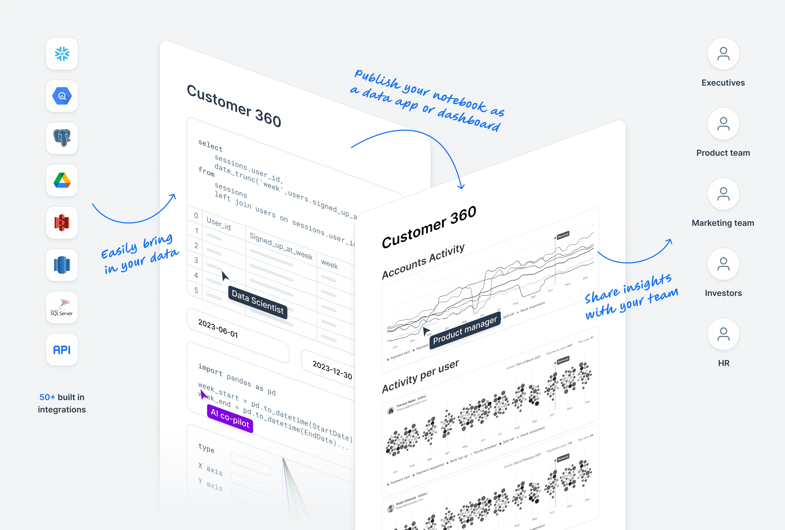
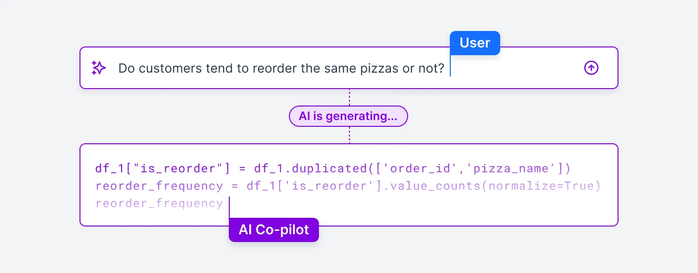
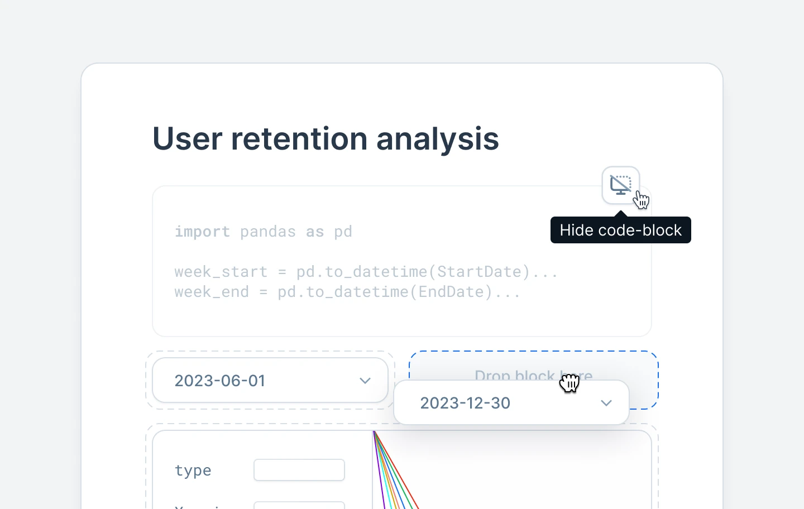

Watch this 5-minute demo to see how more than 100,000 data analysts and scientists use Deepnote.

<iframe width="720" height="405" src="https://www.youtube.com/embed/mLPUNo4O7aA?si=DwlP2Cts1pPVYvfW" title="YouTube video player" frameBorder="0" allow="accelerometer; autoplay; clipboard-write; encrypted-media; gyroscope; picture-in-picture; web-share" allowFullScreen></iframe>

## Why data teams use Deepnote

### 1. Work in one notebook

Deepnote's cloud environment lets team members edit notebooks together, leave comments, and review changes through version history.

Use [SQL blocks](https://deepnote.com/docs/sql-cells) with Python and R in the same notebook.

Connect the notebook to more than 50 [data sources](https://deepnote.com/integrations), including Snowflake, BigQuery, and Postgres.

No-code blocks let team members create charts and inspect data without writing Python.

### 2. Work with Deepnote AI

Deepnote AI uses the context in your project, connected data warehouses, and metadata. It writes suggestions into notebook blocks, where you can inspect the code and its results.

Use [Deepnote AI](https://deepnote.com/docs/deepnote-ai) to generate, explain, or correct code. Choose a model from Anthropic's Claude or OpenAI's GPT families, or use the **Automatic** option.

[AI code completion](https://deepnote.com/docs/ai-code-completion) suggests code as you type based on the notebook context.

[Deepnote Agent](https://deepnote.com/docs/deepnote-agent) can create and edit blocks, run code, inspect outputs, and use your Deepnote MCP integrations.

### 3. Publish a data app

Arrange and publish selected notebook blocks as a dashboard, report, or interactive app. Browse the [Deepnote Explore gallery](https://deepnote.com/explore) for examples.

Arrange charts and inputs in columns to control the app layout.

Choose which input, text, code, and SQL blocks your audience can see.

Add input blocks so your audience can filter and explore the data.

If you encounter any issues, please contact [help@deepnote.com](mailto:help@deepnote.com).
