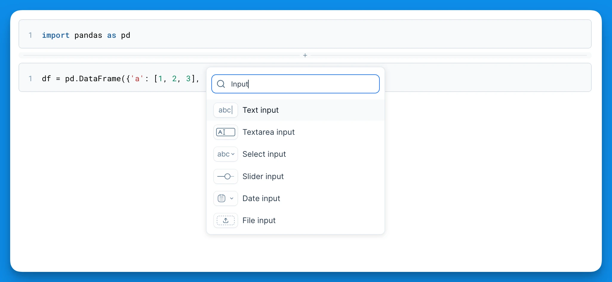
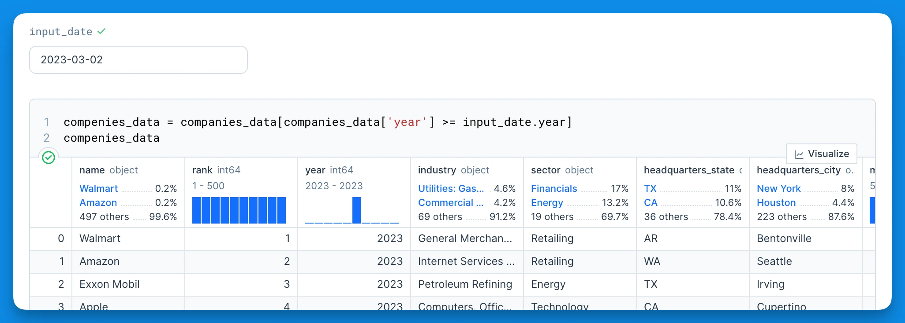
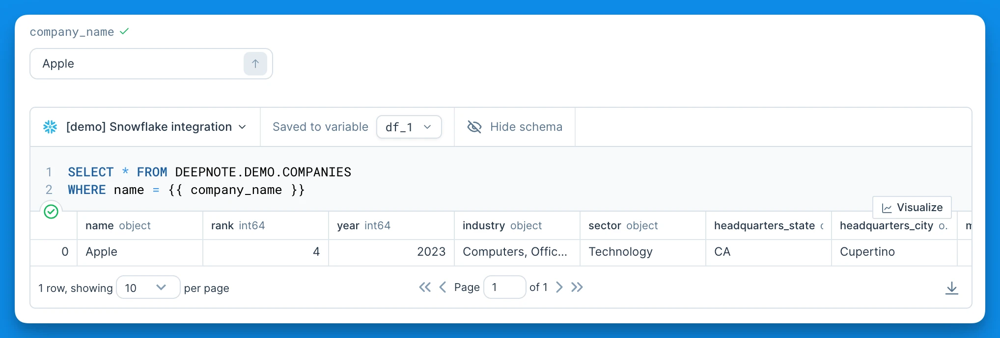
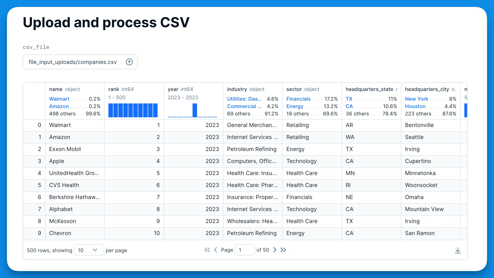
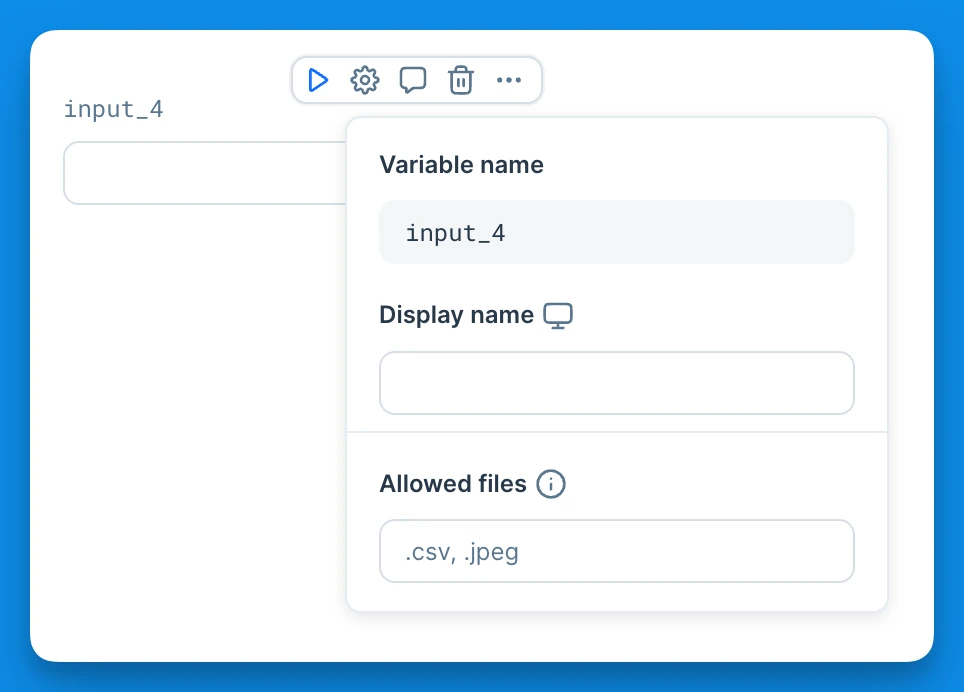
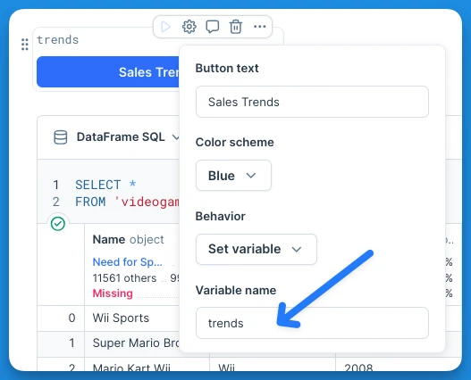
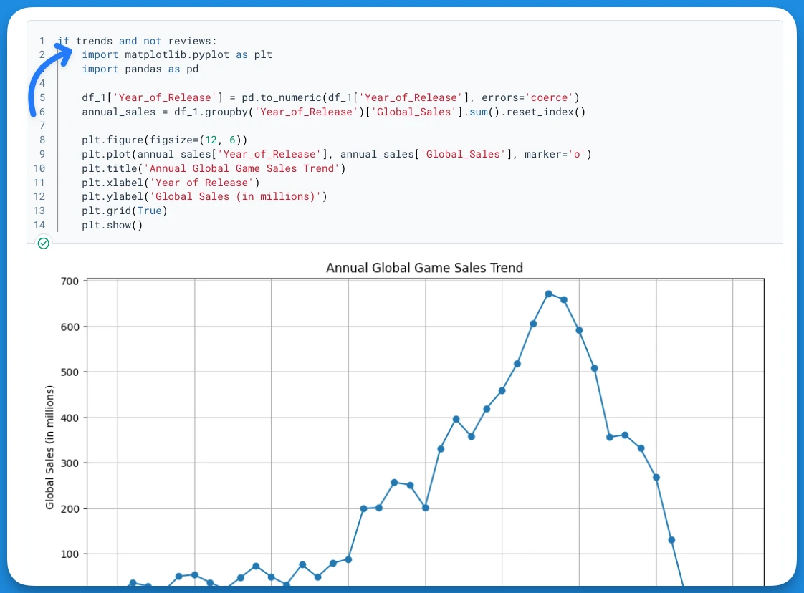
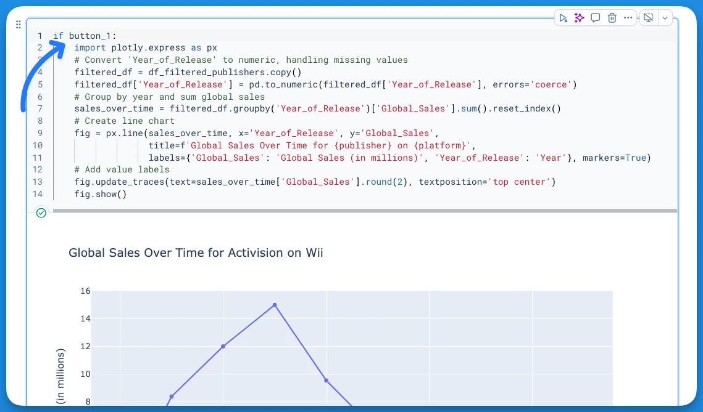
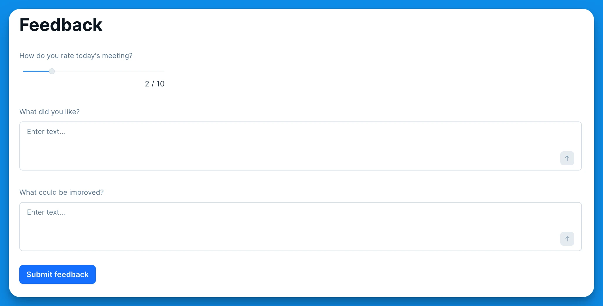
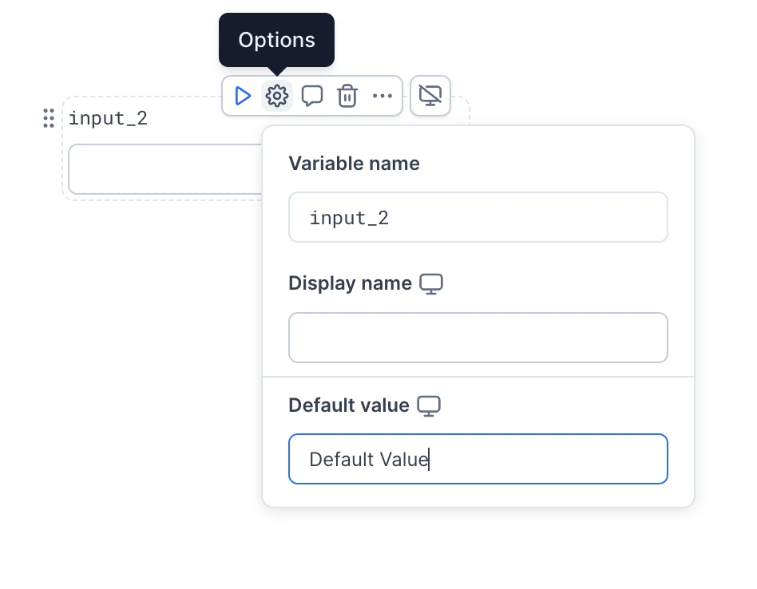

### Adding input blocks

Input blocks are a great way to add different user inputs to be used as variables within your code and SQL blocks. Button block also gives you the ability to control the execution in your notebook or app.

<Callout status="info">

Input blocks can also be used to create [interactive apps and dashboards](https://deepnote.com/docs/data-apps#app-interactivity) from your data apps.

</Callout>

You can easily add an input block to your notebook by clicking the block adder between blocks. Alternatively, you can add input blocks by clicking the Input button at the bottom of your notebook or using the command palette.

Once you've added an input block, you can adjust various settings like variable name and display name. Explore more options for the given input type.

### Using input variables in notebook

You can use the inputs as variables within your code. For example, you can use the date input variable in the code block to filter DataFrame data.

You can also pass on input variables as parameters in your SQL blocks.

### Using input variables in app

Even though all inputs work great both in the notebook and in the app some are particularly powerful in the app.

#### File input

The file input block allows users to easily upload files to your app for further processing.

After uploading the file, the input variable will contain the path to the file. All files are stored in the _file_input_uploads_ folder within your projects and the maximum file size is 5GB. It's also possible to specify allowed file extensions and MIME types.

#### Button block

After adding a button block to your notebook, you can customize its color, label, and behavior when a user clicks it. There are two types of behaviors available:

**1) Set Variable**

With this behavior selected, you can specify a name for a variable, which the button will interact with. When the button is clicked, this variable is set to the boolean value `True`, and any blocks that depend on this variable are executed. You can identify which blocks depend on this variable by inspecting the notebook’s [DAG](https://deepnote.com/docs/execution-modes#directed-acyclic-graph-dag). After the dependent blocks are executed, the variable is reset to `False`.

The "Set Variable" behavior enables you to create more dynamic apps, where outputs are rendered based on user actions. By adding conditions into your Python code blocks based on the button variable's value , you can control when certain code blocks are executed and which block outputs are displayed.

In the demo below, the 'Sales trends' button produces a timeseries chart, while the 'Reviews' button displays correlation data.

<VideoLoop src="../assets/docs/VVeLdkVeSom54VKrAyU8.mp4" />

To enable this type of workflow, all you need to do is configure the button with a variable (eg. 'trends') and then use this variable in a code block as a condition.

When building apps with **multiple input blocks that depend on each other**, you can use the Run button to create more controlled workflows. The button allows you to delay the execution of downstream code until you have all the necessary input values collected from the user - you just need to add a button variable condition to the code block.

<VideoLoop src="../assets/docs/F2UWLLiTK6pg4TxJL5Hy.mp4" />

**2) Run Notebook**

When the user clicks the button, the entire notebook is run. The same applies when the button block is used within an app—all blocks are executed. This behavior is useful for building forms where an explicit "Submit" button is needed, for example.

### Empty input variables

By default, inputs are empty. Additionally, most input blocks can be emptied by clicking the clear button (&times;) next to it, or by deleting its content. Depending which input you're using, the empty values are represented by different Python values:

| Input Type                      | Python Value   | Description          |
| ------------------------------- | -------------- | -------------------- |
| Text input                      | `""`           | Empty string         |
| Select input (single option)    | `None`         | None value           |
| Select input (multiple options) | `[]`           | Empty array          |
| Date input                      | `None`         | None value           |
| Date range input                | `[None, None]` | Tuple of None values |
| File input                      | `None`         | None value           |
| Checkbox input                  | `False`        | Unchecked            |
| Slider input                    | -              | Cannot be empty      |

Learn how to handle empty input values in SQL blocks in the [SQL block documentation](/docs/sql-cells#handling-empty-input-values-in-sql-blocks).

### Default values for Inputs

Deepnote allows you to set defaults for all inputs except the file input. You can edit the default values by clicking on the options button next to the input.

Once you set a default value for an input, this value will be prepopulated in the inputs of your data app.

<Callout status="info">
  Default values for inputs appear in your data app when it is first opened, unless they are overridden by query parameters or the app is set to show last run results.
</Callout>

### Dynamic input variables

In some cases, you may want to dynamically generate the list of available values in select inputs instead of using pre-defined values. You can do so by clicking on input settings and select the 'From variable' option at the Values section. In the dropdown you will need to pick one of your existing variables (supported Python types that can be used are: `list`, `ndarray`, `DataFrame`, and `Series`).

Once you select the variable, the values in the list will be then made available as user inputs in the select input dropdown.

<VideoLoop src="../assets/docs/Kl3C7JoQKeefDuO73MDw.mp4" />

Limits for using dynamic input variables:

1. Only variables with 1,000 elements or fewer are supported.
2. Total characters of all elements cannot exceed 10,000.
