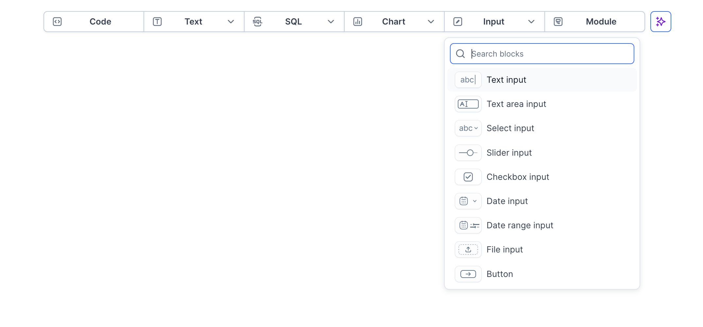

### Adding input blocks

Input blocks let people enter values that can be used in a notebook. Add one with the block adder between blocks, the **Input** button at the bottom of the notebook, or the command palette.

The current Input menu includes:

- Text input
- Text area input
- Select input
- Slider input
- Checkbox input
- Date input
- Date range input
- File input
- Button

### Text input settings

After adding a Text input, enter a value in the block. Open **Options** to edit its **Variable name**, **Display name**, and **Default value**.

Input types can have different settings. The current page records only the controls verified in the live UI. The older app workflows, screenshots, and detailed value rules have been removed until they can be checked again.
