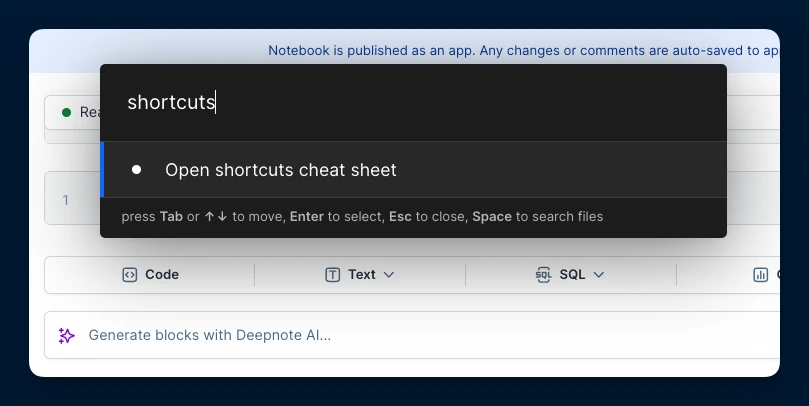

### ⌨️ General

| Mac                        | Windows & Linux               | Action                    |
| -------------------------- | ----------------------------- | ------------------------- |
| <Keyboard>⌘ + P</Keyboard> | <Keyboard>ctrl + P</Keyboard> | Show/Hide command palette |
| <Keyboard>⌘ + K</Keyboard> | <Keyboard>ctrl + K</Keyboard> | Open search bar           |
| <Keyboard>⌘ + .</Keyboard> | <Keyboard>ctrl + .</Keyboard> | Hide/Show UI              |
| <Keyboard>⌘ + [</Keyboard> | <Keyboard>ctrl + [</Keyboard> | Go back                   |
| <Keyboard>⌘ + ]</Keyboard> | <Keyboard>ctrl + ]</Keyboard> | Go forward                |

<Callout status="info">

If you need to quickly look up keyboard shortcuts in Deepnote, just start typing **shortcuts** in the command palette.
</Callout>

### 🧱 Block actions

| Mac                            | Windows & Linux                               | Action                                                                                                          |
| ------------------------------ | --------------------------------------------- | --------------------------------------------------------------------------------------------------------------- |
| <Keyboard>⇧ + ↵</Keyboard>     | <Keyboard>shift + enter</Keyboard>            | 
Run current block and move cursor to next block

(creates a new cell if at the end of the notebook)
 |
| <Keyboard>⌥ + ↵</Keyboard>     | <Keyboard>alt + enter</Keyboard>              | Run block & create code block below                                                                             |
| <Keyboard>⌘ + ↵</Keyboard>     | <Keyboard>ctrl + enter</Keyboard>             | Run current block                                                                                               |
| <Keyboard>⌘ + ⇧ + .</Keyboard> | <Keyboard>ctrl + shift + .</Keyboard>         | Stop execution                                                                                                  |
| <Keyboard>⌘ + ⌥ + H</Keyboard> | <Keyboard>ctrl + alt + H</Keyboard>           | Hide/Show block code                                                                                            |
| <Keyboard>⌘ + ⇧ + H</Keyboard> | <Keyboard>ctrl + shift + H</Keyboard>         | Hide/Show block output                                                                                          |
| <Keyboard>⌘ + ⇧ + M</Keyboard> | <Keyboard>ctrl + shift + M</Keyboard>         | Toggle between code and Markdown block                                                                          |
| <Keyboard>⌘ + ⇧ + ⌫</Keyboard> | <Keyboard>ctrl + shift + backspace</Keyboard> | Delete block                                                                                                    |
| <Keyboard>⌥ + ⇧ + ↑</Keyboard> | <Keyboard>alt + shift + ↑</Keyboard>          | Move block up                                                                                                   |
| <Keyboard>⌥ + ⇧ + ↓</Keyboard> | <Keyboard>alt + shift + ↓</Keyboard>          | Move block down                                                                                                 |
| <Keyboard>⌘ + ⇧ + D</Keyboard> | <Keyboard>ctrl + shift + D</Keyboard>         | Duplicate block                                                                                                 |
| <Keyboard>⌘ + J</Keyboard>     | <Keyboard>ctrl + J</Keyboard>                 | Add new code block below current one                                                                            |
| <Keyboard>⌘ + K</Keyboard>     | <Keyboard>ctrl + K</Keyboard>                 | Add new code block above current one                                                                            |
| <Keyboard>⌘ + Z</Keyboard>     | <Keyboard>ctrl + Z</Keyboard>                 | Undo                                                                                                            |
| <Keyboard>⌘ + ⇧ + Z</Keyboard> | <Keyboard>ctrl + shift + Z</Keyboard>         | Redo                                                                                                            |
| <Keyboard>⌘ + ⌥ + C</Keyboard> | <Keyboard>ctrl + alt + C</Keyboard>           | Add comment                                                                                                     |
| <Keyboard>⌘ + '</Keyboard>     | <Keyboard>ctrl + '</Keyboard>                 | More actions                                                                                                    |
| <Keyboard>⌘ + ⇧ + E</Keyboard> | <Keyboard>ctrl + shift + E</Keyboard>         | Edit code with AI                                                                                               |
| <Keyboard>⌘ + ⇧ + I</Keyboard> | <Keyboard>ctrl + shift + I</Keyboard>         | Explain code with AI                                                                                            |

### ✍️ Code editing

| Mac                            | Windows & Linux                      | Action                                                                                                     |
| ------------------------------ | ------------------------------------ | ---------------------------------------------------------------------------------------------------------- |
| <Keyboard>⌘ + D</Keyboard>     | <Keyboard>ctrl + D</Keyboard>        | Expand selection (multiple cursors)                                                                        |
| <Keyboard>tab</Keyboard>       | <Keyboard>tab</Keyboard>             | 
When caret is at the beginning of a line, add indent

Otherwise, show autocomplete suggestions
 |
| <Keyboard>⇧ + tab</Keyboard>   | <Keyboard>shift + tab</Keyboard>     | Decrease indent                                                                                            |
| <Keyboard>⌘ + /</Keyboard>     | <Keyboard>ctrl + /</Keyboard>        | Toggle line/selection comment                                                                              |
| <Keyboard>⌥ + ↓</Keyboard>     | <Keyboard>alt + ↓</Keyboard>         | Move lines down                                                                                            |
| <Keyboard>⌥ + ↑</Keyboard>     | <Keyboard>alt + ↑</Keyboard>         | Move lines up                                                                                              |
| <Keyboard>⌥ + ⇧ + F</Keyboard> | <Keyboard>alt + shift + F</Keyboard> | Format code                                                                                                |

### 🖥️ Terminal

| Mac                        | Windows & Linux                       | Action             |
| -------------------------- | ------------------------------------- | ------------------ |
| <Keyboard>⌘ + C</Keyboard> | <Keyboard>ctrl + shift + C</Keyboard> | Copy selected text |
| <Keyboard>⌘ + V</Keyboard> | <Keyboard>ctrl + shift + V</Keyboard> | Paste              |
