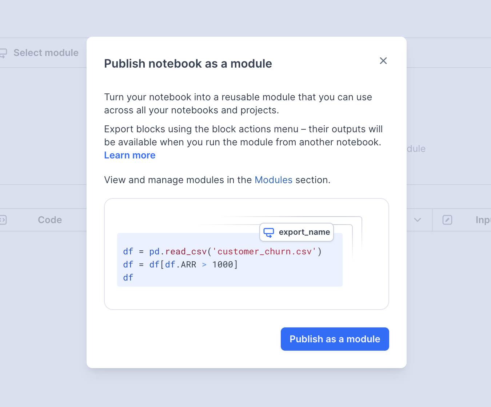

Modules package notebook workflows for reuse across a workspace.

## Creating a module

Open the notebook you want to publish and use the module control in the notebook header. The publish dialog explains that the notebook will become a reusable module and includes a **Publish as a module** action.

Publishing changes the workspace, so review the notebook before confirming.

## Adding a module block

Use the **Module** button in the notebook footer to add a module block. The current block starts with **Select module** and **Select a module**. Choose a published module when one is available.

The current UI did not expose the older export, parameter, library, update, or AI workflows described in this page. Those details and their screenshots have been removed until they can be checked again.
