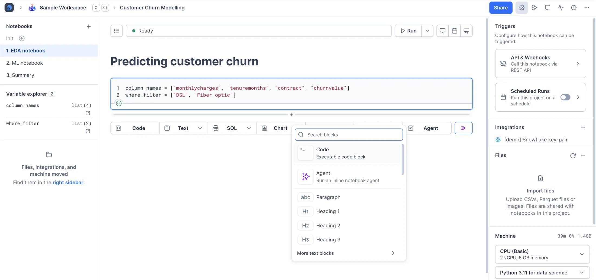
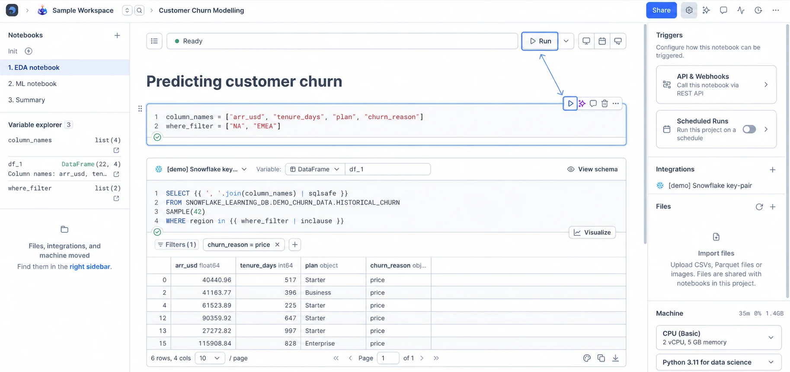
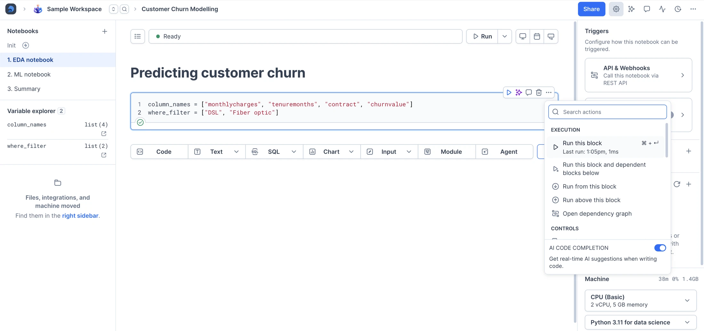

## What is a notebook in Deepnote?

Beyond being a powerful computational medium, Deepnote notebooks are fully collaborative documents. They combine SQL, Python, and no-code tools into an analytics environment suitable for data teams.

### Composing with building blocks

Notebooks are made up of a series of blocks. Each major type of content or action you can perform has its own block type:

- Code blocks enable you to write and execute Python code (or [other languages](https://deepnote.com/docs/running-your-own-kernel)).
- [SQL blocks](https://deepnote.com/docs/sql-cells) are used to write SQL queries against databases, pandas DataFrames, and CSV files.
- [Text blocks](https://deepnote.com/docs/text-editing) allow you to compose richly formatted text.
- [Chart blocks](https://deepnote.com/docs/chart-blocks) provide you with a point-and-click charting tool for efficient data visualizations.
- [Input blocks](https://deepnote.com/docs/input-blocks) are interactive widgets that capture user inputs and pass them as variables to your Python code and SQL queries.
- [Big number blocks](https://deepnote.com/docs/big-number-blocks) highlight a single key metric front and center in your dashboards and apps.
- Pivot table blocks let you summarize and cross-tabulate your data without writing code.
- Agent blocks run an AI agent step inside your notebook and can use your connected MCP integrations.

Blocks can easily be added to your notebook via the **add block** (**+**) menu or by selecting a block category from the bottom of your notebook.

### Executing blocks to generate results

In order to see output from your code, you need to execute the corresponding block. You can do this in three ways:

- Click **Run** at the top of the notebook to execute all blocks from top to bottom. Execution stops if a block produces an error.
- Hover over a block and click **Run** in its toolbar.
- Press **Cmd/Ctrl** + **Enter** on your keyboard while focused on a block.

### Exploring helpful block operations

Hover over a block to show its toolbar. Use it to run the block, add a comment, or delete it. Open **More actions** for options such as duplicating the block, copying its link, or moving it up or down. You can also reorder blocks by dragging the handle on the left. Available actions depend on the block type.

### Changing the working directory of a notebook

By default, the working directory of your notebook is the same as the root of the file system in the right sidebar. Its absolute path is `/work`. To change a notebook's working directory, click its context menu, scroll down to **WORKING DIRECTORY** and click the ⚙️ symbol.

<Callout status="info">
If you have [imported a Jupyter notebook](https://deepnote.com/docs/importing-and-exporting-jupyter-notebooks) and you want to execute it, make sure you place it in the dedicated **Notebooks** section. Jupyter files that exist in the **Files** section are "read-only."
</Callout>
