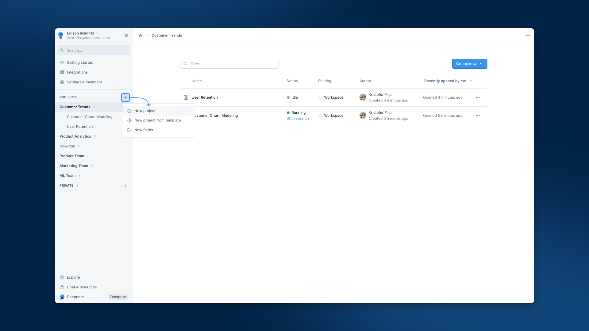
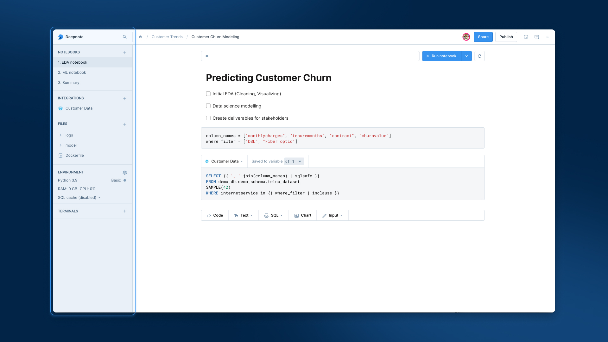
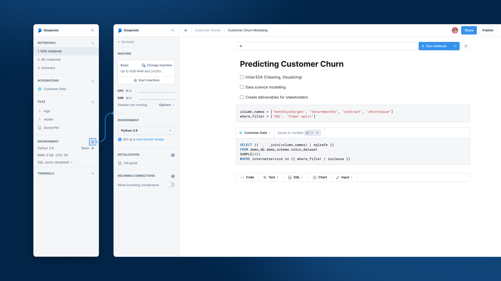

## What can you do with projects?

Projects do a lot, from shared data sources across multiple notebooks to native version control. Here are some highlights:

- Projects contain notebooks and therefore can be used to organize related work (e.g., EDA notebook, ML notebook)
- Projects define your environment — including the Python version, required libraries, and the machine specifications (i.e., RAM, number of cores).
- Projects have their own file system and provide access to database integrations.

### Creating a project

From the left panel in your Workspace, you can click the **"+"** symbol next to **PROJECTS** to create a new project, either from scratch or from Deepnote's built-in templates. In addition, clicking on the ellipses beside a project will provide options for creating, duplicating, and moving projects (and more).

Don't forget that you can arrange your projects into folders here, too. Just drag and drop them to suit how you like to organize your work.

    

Let's move to the newly created Project panel now. Notice that the left panel has changed and you are focused on the context of your Project.

### Learning the most important bits

The project sidebar contains your notebooks and terminals. Open the **Settings** panel from the top-right to manage integrations, files, the machine, and the environment.

    

#### Notebooks

The **Notebooks** section can contain multiple notebooks. This is helpful since multiple notebooks are often needed to accomplish an overall goal. Read more about Deepnote's powerful notebooks [here](https://deepnote.com/docs/notebooks).

#### Integrations

Open **Settings** from the top-right and choose **Integrations** to connect [databases and warehouses](https://deepnote.com/docs/snowflake), [buckets](https://deepnote.com/docs/amazon-s3), [Docker container registries](https://deepnote.com/docs/amazon-ecr), and [secrets](https://deepnote.com/docs/environment-variables). Your collaborators can use these shared connections without extra setup.

#### Files

Open **Settings** from the top-right and choose **Files**. Drag a CSV into this section or upload the other scripts and files you need. The file system is shared by all notebooks in the project. To learn more about working with the file system, read our [file system guide](https://deepnote.com/docs/importing-data-to-deepnote).

<Callout status="success">

Got a `requirements.txt` file? We create one for you when you `pip` install a package. And we automatically install the listed packages every time your machine starts up.

</Callout>

#### Environment

Open **Settings** from the top-right and choose **Machine**. Use the **Environment** dropdown to view the environment configuration options.

**Machine:** Use the machine picker in the **Machine** section to change the project hardware. Team and Enterprise plans include unlimited hours on a 16GB, 4vCPU machine. Read more about [machines in Deepnote](https://deepnote.com/docs/machine-hours).

**Built-in environments:** From the dropdown menu (under **Environment**) you can choose between any of the built-in Python environments. They come [pre-installed with the most popular libraries](https://deepnote.com/docs/pre-installed-packages) so you can begin working immediately. The default environment is Python 3.11.

<Callout status="info">

🔥 If the built-in environments don't meet your needs, no problem. You may **define a local Dockerfile** or bring your own image from any registry (e.g., ECR, Docker Hub, etc.). To learn more about custom environments, [hop over here](https://deepnote.com/docs/custom-environments).

</Callout>

**Initialization notebook:** There are times when you want to run some "starter" code before your notebook is used. You can place such code in a notebook called 'Init'. Read more about setting up custom [project initialization](https://deepnote.com/docs/project-initialization).

**Incoming connections:** Open **More options** next to **Start machine** in the **Machine** section to [enable incoming connections](https://deepnote.com/docs/incoming-connections). You can use incoming connections to host tools such as Airflow, Streamlit, and TensorBoard.

#### Terminals

We all need a CLI every now and then, even if we are notebook lovers. You can create terminals by clicking the **+** button in the **Notebooks** section and selecting **Create a new terminal** from the dropdown menu. Terminals appear below your notebooks in the same section. Read more about terminals [here](https://deepnote.com/docs/terminal).

### Project templates

In case you'll find yourself attaching the same integrations, or using the same environment in most of your projects, you can save the project as a template. To do that, click on the dropdown option of your project, and click "Add to templates".

<Callout status="info">

Under the hood, a project template is just a special type of project - this means that you can edit and execute notebooks in it. Once you convert a project to a template, you won't find it in the workspace sidebar anymore, but in the "New project from template" modal.

</Callout>

## Going deeper with projects

Projects can do so much more. We encourage you to check out how to use [comments](https://deepnote.com/docs/comments), how to [version projects](https://deepnote.com/docs/history) and view their history, and how to [connect to GitHub](https://deepnote.com/docs/github).
