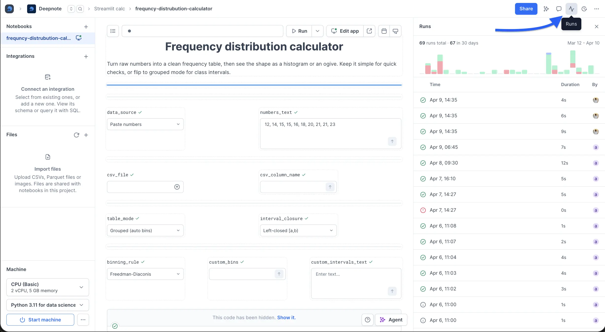
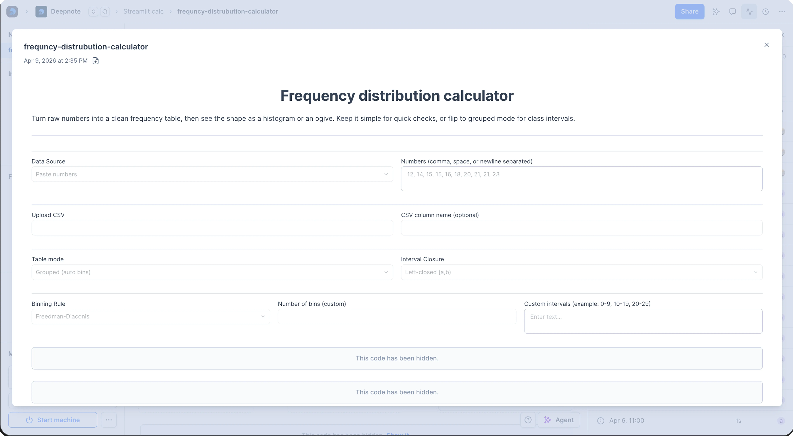

Every time you run a notebook, Deepnote automatically creates an immutable **run snapshot**. This frozen record shows the notebook's state when the run completed. You can revisit any past run without executing it again.

## What's captured

Each snapshot includes:

- **All blocks and outputs:** The full notebook content as it appeared after execution
- **Execution metadata:** Who triggered the run, when it started and finished, and how they triggered it (manually, via [schedule](/docs/scheduling), or through the [API](/docs/deepnote-api))
- **Execution summary:** The total block count, how many succeeded or failed, and the duration

<Callout status="info">
Snapshots are read-only. They capture the notebook state at execution time and cannot be edited.
</Callout>

## Where to find snapshots

You can access run snapshots from three places:

- **Runs sidebar:** Click **Runs** in the project top bar to open a sidebar that lists recent runs with status indicators. Click any run to view its snapshot.
- **Project logs:** The history tab shows past executions. Runs with available snapshots display a **View run** button.
- **Logs & Analytics modal:** Open the project top bar context menu and select **View analytics** to see execution history and open snapshots.
- **Version history:** Past runs also appear in your notebook's version history, where you can open the read-only snapshot.

When you open a run, Deepnote displays the immutable snapshot in a modal so you can inspect the notebook exactly as it looked when that execution finished.

Each snapshot has its own URL, so you can link a teammate straight to a specific run, and you can download a snapshot to keep a local copy. How long snapshots are retained depends on your workspace's retention tier.

## Use cases

- **Debug failed scheduled runs:** See what happened when a notebook failed overnight, including which block produced an error and what the outputs looked like before the failure
- **Audit trail:** Review who ran a notebook and when, with the output history across manual, scheduled, and API-triggered runs
- **Collaboration:** Send teammates a link to a run's results instead of asking them to execute the notebook again
