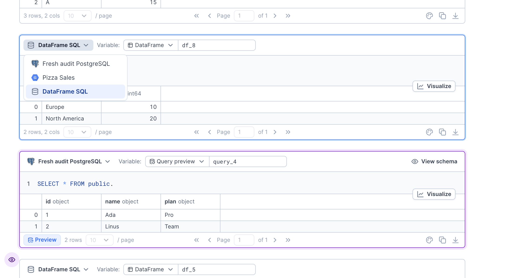
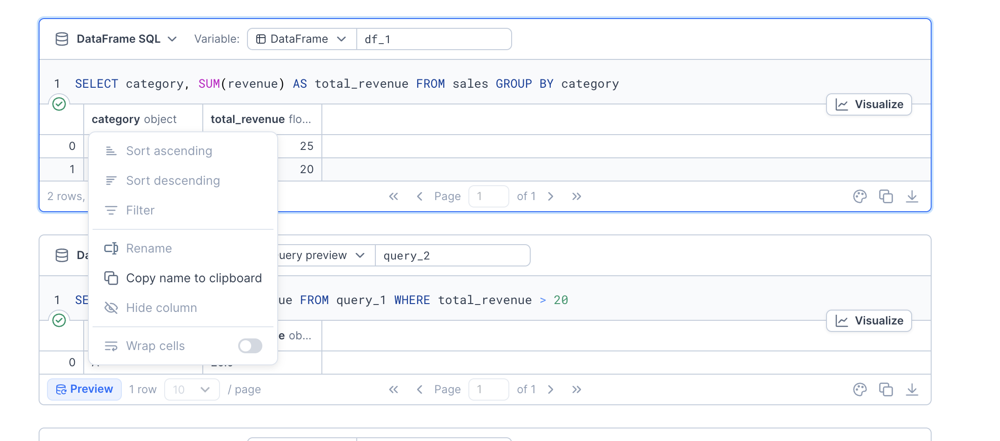

### Getting started with SQL blocks

To make it easier to query databases, data warehouses, or CSV files, Deepnote offers a native way to write and execute SQL code through **SQL blocks**. After connecting your data source to Deepnote (for example [PostgreSQL](/docs/postgresql), [Redshift](/docs/redshift), [BigQuery](/docs/google-bigquery), or [Snowflake](/docs/snowflake)), you can create SQL blocks in your notebook and begin writing SQL queries or [generate them with AI](/docs/sql-generation).

When you run a SQL block, Deepnote executes the query and stores the full result in a DataFrame object by default. Features like [query caching](/docs/sql-query-caching), [query chaining](/docs/sql-cells#Query-chaining), and [AI autocompletions](/docs/sql-cells#SQL-autocomplete) make SQL blocks more powerful and convenient to use.

To get started:

1. Create a SQL block from the block adder (or by uploading a CSV file)
2. Select the data source you want to query
3. Name the results variable



<Callout status="info">
SQL blocks work in Python notebooks, as well as in R notebooks (where they run via reticulate).
</Callout>

### Dataframe SQL

Apart from querying a database, you can also use SQL blocks to query your DataFrames or even tabular files like CSV or Excel. To do that, create a SQL block and select the "DataFrame SQL" option as the data source.
DataFrame SQL blocks can also be created from a CSV file in the project's **Files** section by opening the file and choosing **Quick query with SQL**. By executing that SQL block, the contents of the CSV file will be loaded into a DataFrame variable.

Here's an example of querying a DataFrame variable, `df`:

```sql
SELECT *
FROM df
```

Here's how you can query an existing CSV file:

```sql
SELECT *
FROM 'path/to/my_data.csv'
```

<Callout status="info">
DataFrame SQL uses duckdb under the hood. Visit the [duckdb reference](https://duckdb.org/docs/sql/introduction) for details about this specific dialect of SQL.
</Callout>

### Data table output

When you execute a SQL query, Deepnote displays the result in a data table. The data table helps you understand your data quickly through column descriptors such as breakdowns of column values for categorical columns or summary statistics for numeric columns.



Have a look at the [data table documentation](/docs/data-tables) for more details on how to further modify the data table through things like column filtering, column renaming or conditional cell formatting.

### Output modes

SQL blocks offer two distinct output modes: **DataFrame** mode and **Query preview** mode, each with its own use case.

1. DataFrame

- By default, Deepnote saves the full results of executed queries into a Pandas DataFrame. In the above example, it's `df_1`. You can use this variable for further processing in normal Python code blocks below.

2. Query preview

- Query preview mode retrieves only the first 100 rows of the result. Instead of creating only a DataFrame, it also stores the source SQL code used to query that data. You can reference these query previews in later SQL blocks to build complex queries through query chaining. Query preview mode lets you decide when to pull the full result into memory while leaving the data in the warehouse until then.

<Callout status="info">
Under the hood, Deepnote appends a LIMIT clause to your query preview mode queries.
</Callout>

Q: When should I use query preview mode instead of DataFrame mode?

A: Use query preview mode when you want to defer pulling data into memory or when you are building complex SQL queries that you want to test in iterations. Use DataFrame mode when you want to process the full result of a query at once.

Q: Can I reference DataFrame variables in SQL blocks?

A: Yes. In DataFrame SQL blocks, you can query DataFrame variables such as `sales`. Database-backed SQL blocks can reference query preview objects.

Q: Can I use query preview mode with DataFrame SQL blocks?

A: Yes! Even though you are querying a DataFrame, you may want to retrieve only a subset of the data and reference the query later.

Q: Can I use query preview objects in other blocks?

A: Yes, you can use query previews much like a DataFrame. The `DeepnoteQueryPreview` object is a subclass of a Pandas DataFrame, so you can also plot it in a Chart block. Keep in mind that the preview contains only the first 100 rows.

### Query chaining

Query chaining makes complex SQL development simpler and more efficient. Instead of writing one massive query, you can break your logic into manageable steps across multiple blocks, using query preview to see results without loading entire datasets. Each query becomes a reusable building block that you can reference in subsequent SQL blocks. Behind the scenes, Deepnote automatically combines these references by generating proper CTE statements, giving you both the clarity of step-by-step development and the power of properly structured SQL. This approach makes your code easier to understand, debug, and maintain while keeping memory usage minimal.

For example, let's say that we often query "large pizzas" from our Pizza Sales dataset. We can write a query and get back a preview of the first 100 results:

The result is stored as `large_pizzas`, which can then be used downstream in another SQL block. Let's say that we'd like to fetch some basic metrics for sales of large pizzas. We can reference the `large_pizzas` object as if it were a CTE:

The current SQL block actions menu does not include a compiled SQL query view.

<Callout status="warning">
Query chaining only works for single `SELECT` statements. This includes the use of CTEs but statements like `INSERT`, `UPDATE` or `DELETE` are not supported.
</Callout>

### Query caching

With caching enabled, Deepnote automatically saves the results of your queries in SQL blocks. Returning these cached results for repeated queries can improve performance in your notebooks and reduce the load on your database or warehouse. See [Query caching](/docs/sql-query-caching) for more information on how to use and customize it.

### SQL autocomplete

SQL blocks provide schema _Intellisense_ suggestions. The block actions menu also includes an AI code completion setting.

The built-in _Intellisense_ offers relevant suggestions for your cursor position. This includes entities in your schema such as databases, tables, or columns, as well as aliases, CTEs, or query previews that you defined in previous queries. You can trigger it manually with <Keyboard>Control + Space</Keyboard>, <Keyboard>Option + Space</Keyboard>, or <Keyboard>⌘ + I</Keyboard>.

### Using Python and SQL together

Deepnote lets you work with SQL and Python together. Results of SQL blocks generate DataFrames or query preview objects that you can use in your Python code.
However, you can also pass in your Python variables to SQL blocks. Deepnote uses [jinjasql](https://github.com/sripathikrishnan/jinjasql) templating which allows you to pass variables, functions, and control structures (e.g., _if_ statements and _for_ loops) into your SQL queries.

- To inject a Python variable into your SQL query, use the `{{ variable_name }}` syntax. For example:

```sql
SELECT date, name
FROM fh-bigquery.weather_gsod.all
WHERE name = {{ station_name  }}
LIMIT 10
```

- Passing lists or tuples into your SQL queries requires the `inclause` keyword from JinjaSQL. As shown below, use the same syntax with this keyword preceded by the `|` symbol.

```sql
SELECT date, name
FROM fh-bigquery.weather_gsod.all
WHERE name in {{ station_list | inclause}}
ORDER BY date DESC
```

- To inject column names and table names, use the `sqlsafe` keyword as follows:

```sql
SELECT *
FROM {{ table_name | sqlsafe }}
```

- A common use case is searching for a wildcard pattern containing the `%` character, which represents optional substrings. To combine this with a variable value, use the following syntax:

```sql
SELECT *
FROM users
WHERE name LIKE {{ '%' + first_name + '%' }}
```

- You can also use more advanced templating features like ` `, conditional blocks, or anything else supported by JinjaSQL. For example, the following block loops through a Python list (`column_names`) to construct the desired SQL fields.

```sql
SELECT date, name,


    
        {{ col | sqlsafe }},
    
        {{ col | sqlsafe }}
    


FROM fh-bigquery.weather_gsod.all
WHERE date > '2015-12-31'
AND name = {{ station_name }}
ORDER BY date DESC
LIMIT 5
```

### Handling empty input values in SQL blocks

In some instances, you may want to use an input value that can be empty in a SQL block. For example, you might want to give the user the ability optionally filter a table. In those instances, you need to handle `Null` values in your SQL blocks. Here are two practical approaches:

1. **Using JinjaSQL conditional blocks**
   This approach is particularly useful when you want to conditionally include entire SQL clauses:

```sql
SELECT signup_date, name
FROM users

  WHERE signup_date >= {{ start_date }}

```

2. **Using SQL's native NULL handling**
   This approach leverages SQL's built-in NULL handling capabilities, which can be more concise when dealing with simple conditions:

```sql
SELECT signup_date, name
FROM users
WHERE signup_date >= {{ start_date }}
   OR {{ start_date }} IS NULL
```
