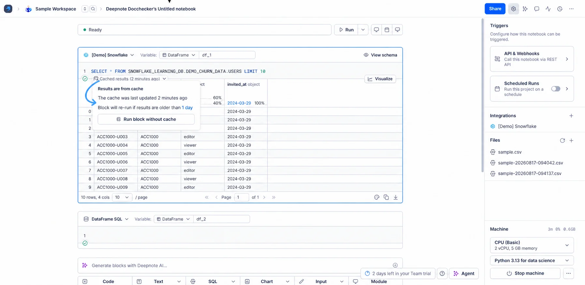
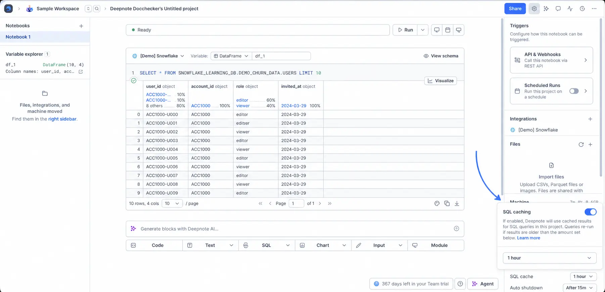
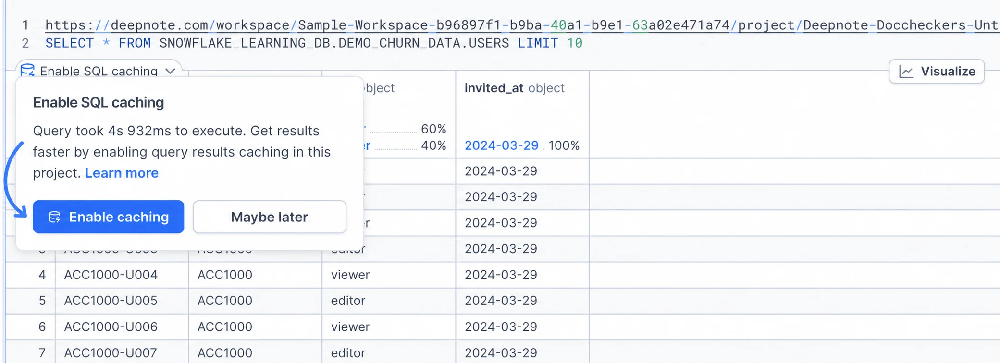
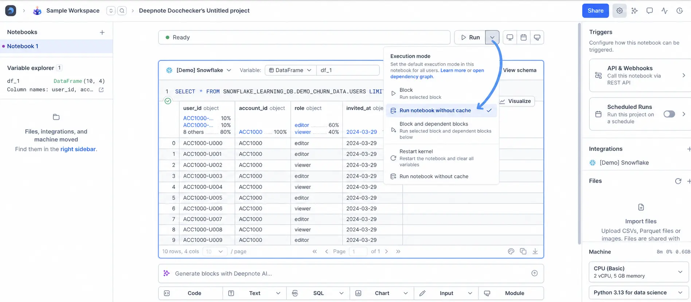
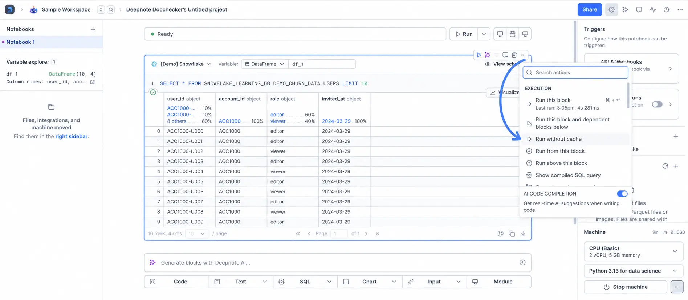

With caching enabled, Deepnote automatically saves the results of your queries in SQL blocks. Returning these cached results for repeated queries can greatly improve performance in your notebooks and reduce the load on your database/warehouse.

Main benefits:

- **Improved performance**: By utilizing cached results, you can experience significantly faster SQL execution times, as data is retrieved from the cache instead of querying the warehouse repeatedly. With lightning-fast queries, you can focus more on your data analysis instead of waiting around for results to arrive.
- **Reduced database load**: Caching minimizes the number of queries sent to the warehouse, reducing the load on the database and giving you better control over your query costs.
  <Callout status="info">
  Query caching is available on **Team** and **Enterprise** plans.
  </Callout>

## How to enable caching

### Saving cached results

To save SQL block results in a project's cache, open **More options** in the **Machine** section of the right sidebar and select **SQL cache**. Turn on **SQL caching** in the popover. Deepnote reruns queries when they are older than the selected expiration period.

When **SQL caching** is turned **on**, Deepnote stores the results of SQL block queries in the cache. The SQL block displays the query result after execution. Cached-result controls are available only in projects where caching is enabled.

When **SQL caching** is turned **off**, query results are not saved to the cache.

### Surfacing cached results

After a query runs while project caching is disabled, the SQL block can show an **Enable SQL caching** prompt. Select **Enable caching** to turn on caching for the project.

## How does caching work?

When you run a SQL block in a project where caching is enabled, Deepnote checks for a cached result that is no older than the project’s cache expiration period, which is 1 day by default.

- If a recent cached result is available, the query is not sent to the warehouse. Instead, the cached result is pulled into memory and displayed in the DataFrame table.
- If there are no cached results or the cached results are older than the project’s cache expiration period, the query is executed against the warehouse, and the results are saved to the cache.

In the SQL block, select **Cached results** and then select the current expiration period to choose a new one. The available options are **1 hour**, **12 hours**, **1 day**, and **1 week**. To refresh results at most once a week, choose **1 week**.

## Block execution without cache

When caching is enabled for a project, running the whole notebook or executing individual SQL blocks will always attempt to use cached results. However, you can override this behaviour and force re-execution of the query against the warehouse in two ways:

1. In the dropdown options of the **Run notebook** button, select **Run notebook without cache** to execute the notebook without utilizing cached results.

   

2. In the block sidebar, select **Run without cache.** Clicking on this option forces the specific SQL block to pull fresh results from the warehouse.

   

These options are only displayed if project-level caching is enabled.

<Callout status="info">
**Scheduled runs** of notebooks **do not read from the cache**: queries always hit the warehouse for fresh data. When SQL caching is enabled for the project, scheduled runs also write their results to the cache, so scheduling can be used to “pre-cache” results for later use.
</Callout>

## Exceptions

Caching has the following limitations: - If the returned result is larger than 5GB, caching won’t be applied to that given query. - Caching only works for SQL blocks connected to integrations; DataFrame SQL blocks do not utilize the cache. - Caching is disabled for integrations that uses OAuth for authentication.

In addition, while query caching offers great benefits, there may be specific scenarios where relying on caching may not be ideal.

If you work on projects where **freshness of data is crucial**, such as analyzing (near) realtime data or checking the results of recent data manipulations in your warehouse. You can mitigate against unexpected results by forcing re-execution without cache or turning off caching for the given project.

When you use **non-deterministic functions** in your SQL queries. For example, date and time functions such as `CURRENT_TIMESTAMP()` and `CURRENT_DATE`, and other functions such as `SESSION_USER()`. These functions generate different values depending on the time of execution and caching cannot take that into account.

Potential workarounds for these cases include: - [Using Python variables in your SQL queries](https://deepnote.com/docs/sql-cells#using-python-and-sql) instead of native SQL functions. These will evaluate before sending the query therefore cached results will be saved for each unique value. - Setting lower cache expiry periods in your project. For instance, if you have a 1 hour expiry set, using `CURRENT_DATE` in your SQL query is a suitable option. - Turning off caching in your project.

## **Data Retention**

We automatically remove any cached data after **30 days.**
