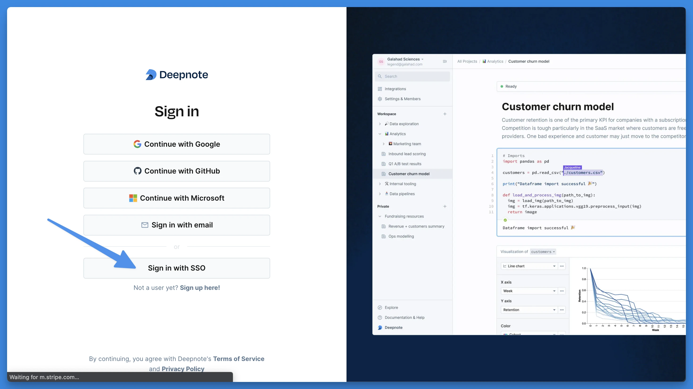
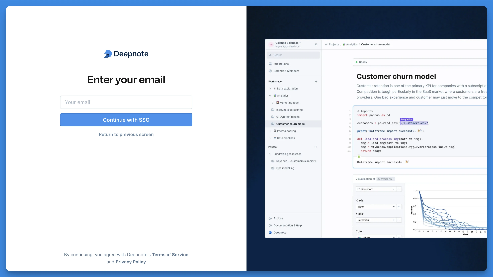

## Single sign-on

With Single Sign-On, all members of your organization will be able to log in to Deepnote without any prior registration. You can control which users or groups can log in to Deepnote using your Identity Provider.

<Callout status="info">

This feature is available on the Enterprise plan.

</Callout>

Deepnote supports single sign-on (SSO) via SAML and OIDC, such as Google, Okta, Azure AD or OneLogin. When you sign up for the Enterprise plan our support team will send you a link to a setup wizard, which will guide you through the settings.

#### Sign in with SSO

After our support has activated Single Sign-On for your company You can go to [deepnote.com/sign-in](https://deepnote.com/sign-in) and select **Sign In with SSO.**

You will be prompted to enter your email address.

After supplying your company email address, click on **Continue with SSO**
 and you will be redirected to your Identity provider sign-in page.

#### Get started with SSO

For instructions to set up SSO for your workspace, please reach out to your customer success manager or to the support.

## Directory sync

<Callout status="info">

This feature is available on the Enterprise plan.

</Callout>

Deepnote supports directory sync via SCIM. When you sign up for the Enterprise plan and require this feature please reach out to our support team or your CSM and we will guide you through the setup.

##### Default groups

Deepnote provides a selection of pre-defined groups that can be used within your directory. When users are assigned to these groups, they are automatically assigned the corresponding role in Deepnote. Users who don’t belong to a group will be assigned the **Viewer** role. All currently supported groups are listed in the template below.

| IdP Group        | Deepnote role |
| ---------------- | ------------- |
| Deepnote Viewer  | Viewer        |
| Deepnote Editors | Editor        |
| Deepnote Admins  | Admin         |

For role assignment to work properly, users must be direct members of the group. This means that **nested groups are not supported**.

User does not get editor rights:

- 👥 Deepnote Editors
  - 👥 Data team
    - 👤 James Smith ❌

User gets editor rights:

- 👥 Deepnote Editors - 👤 James Smith ✅

##### Custom groups

If you have strict naming conventions for your groups or prefer not to add more groups to your directory, we can assist you in mapping your existing groups to specific roles in Deepnote. This mapping process is currently handled by our support team.
