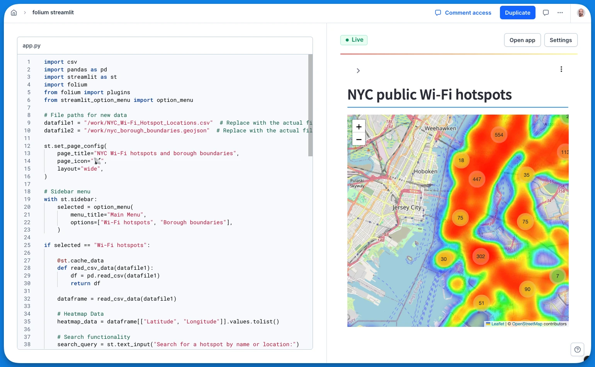
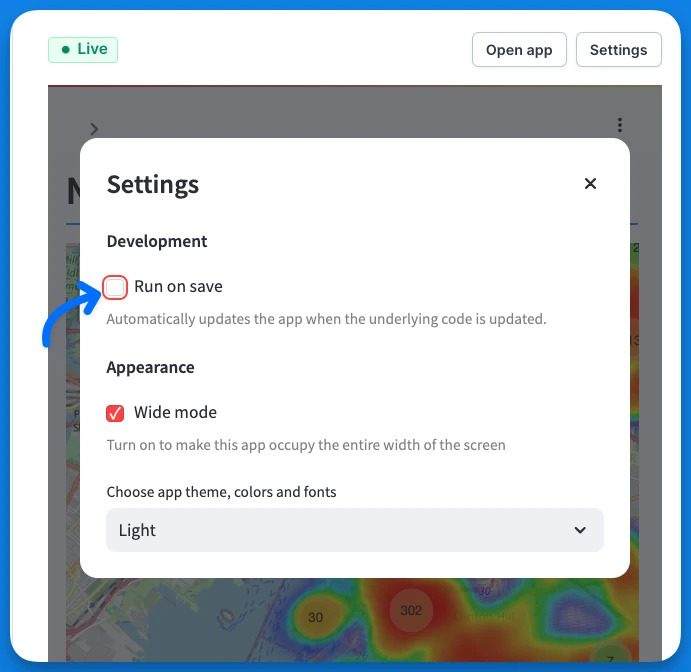
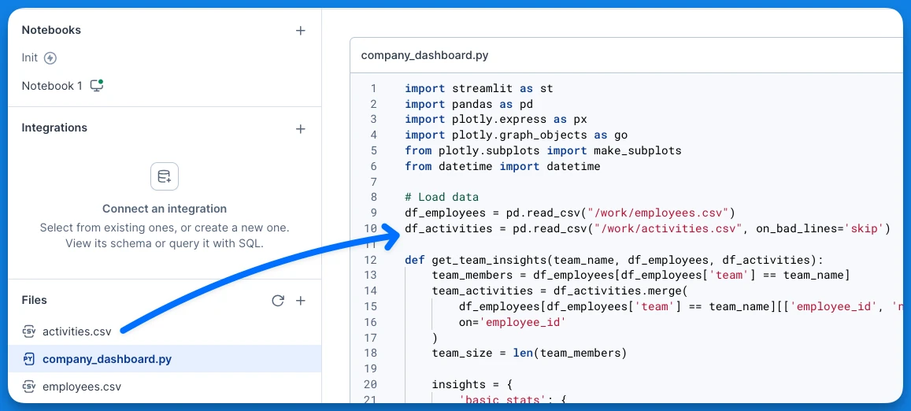

Streamlit is a popular open-source Python framework for creating interactive dashboards and data apps. With Deepnote's native Streamlit support, you can host and share these apps directly in your workspace. All you need is your Python script - Deepnote handles the rest.

Get started by exploring our [example apps](https://deepnote.com/explore#streamlit-apps) or watch our quick guide:

<Embed url='https://www.loom.com/embed/e4bb3ea481e642d288733ea0c1c275f5?hide_owner=true&hide_share=true&hide_title=true&hideEmbedTopBar=true' />

## Creating an app

There are two ways to get started with Streamlit in Deepnote:

1. Drop in existing scripts. Simply drag and drop your `.py` file into your project's **Files section**. Deepnote automatically detects Streamlit apps and begins deployment. In seconds, you'll see your live app in the split-screen preview.
2. Start from scratch. Create a new `.py` file and write your Streamlit code directly in Deepnote - from simple buttons to complex interactive elements. When ready, click the **Create Streamlit app** button in the upper right corner to deploy.

Once deployed, use the **Open app button** to see your app in its full shared state.



## App status

Your project's hardware serves your Streamlit apps. The indicator in the upper left corner of the app preview shows three possible states:

- `Live`: App is deployed and running - visitors can interact immediately
- `Sleeping`: App is deployed but project hardware is inactive - visitors will wait for initialization
- `Deploying app`: App is updating and temporarily unavailable

## Editing an app

When you make changes to your app's code, your updates will be reflected immediately in the live app.

Note: this means anyone viewing your app will see these changes as they happen. If you prefer to control when updates go live, you can disable automatic updates in the Streamlit settings (hamburger icon, Settings) by turning off the **Run on save** option.



## Sharing an app

To share your deployed app, click **Settings** and **Copy link**.

Important: Your app inherits your project's sharing settings. To make your app visible to people outside your Deepnote workspace, go to Share in the project header and set link sharing to 'View'. This allows others to view your app and project content but prevents them from making any edits.

## Using data

Streamlit apps often need data to visualize. Deepnote's notebook environment is perfect for preparing datasets for your Streamlit dashboards:

1. Create notebooks to process your data using our SQL integrations and AI assistance
2. Save your results (commonly as `.csv` files)
3. Reference these files in your Streamlit script

Need to update your data regularly? Take advantage of [notebook scheduling](https://deepnote.com/docs/scheduling) to automate your data preparation.



## Using integrations

It is possible to use integrations connected to your project from a Streamlit app.

For storage integrations, such as S3, Google Drive, or Shared Datasets, you can access the files in Python the same way you would in notebooks.

For integrations that rely on specific environment variables (such as database integrations like Snowflake, Postgres, or BigQuery), you need to include a specific code snippet at the beginning of your Streamlit app to populate the app with the required environment variables:

```python
import deepnote_toolkit
deepnote_toolkit.set_integration_env()
```

An example app that connects to the demo Snowflake integration and renders a DataFrame could look like this:

```python
import streamlit as st
import os
import snowflake.connector
import pandas as pd

import deepnote_toolkit
deepnote_toolkit.set_integration_env()

st.header('Snowflake table')

conn = snowflake.connector.connect(
    account=os.environ["_DEMO__SNOWFLAKE_ACCOUNTNAME"],
    user=os.environ["_DEMO__SNOWFLAKE_USERNAME"],
    password=os.environ["_DEMO__SNOWFLAKE_PASSWORD"],
    database=os.environ["_DEMO__SNOWFLAKE_DATABASE"],
    role=os.environ["_DEMO__SNOWFLAKE_ROLE"],
)

query = f"SELECT * FROM DEEPNOTE.DEMO.COMPANIES"
df = pd.read_sql(query, conn)
conn.close()

st.dataframe(df)
```

### Per-viewer authentication with OAuth integrations

If your integration uses a federated authentication method (Snowflake OAuth, Snowflake with Okta, Snowflake with Azure AD, BigQuery with Google OAuth, or Trino OAuth), the static environment variables shown above are not populated, because each viewer of the app authenticates with their own credentials rather than reusing the project owner's.

Use the helpers in `deepnote_toolkit.streamlit_data_apps` to obtain a database client scoped to the current viewer.

A Snowflake app that connects via Snowflake OAuth and renders a DataFrame:

```python
import streamlit as st
import pandas as pd
from deepnote_toolkit.streamlit_data_apps import get_snowflake_connection

INTEGRATION_ID = "<paste-integration-uuid-here>"

st.header('Snowflake table')

conn = get_snowflake_connection(INTEGRATION_ID)
df = pd.read_sql("SELECT * FROM DEEPNOTE.DEMO.COMPANIES", conn)
conn.close()

st.dataframe(df)
```

A BigQuery app that connects via Google OAuth and renders a DataFrame:

```python
import streamlit as st
from deepnote_toolkit.streamlit_data_apps import get_bigquery_client

INTEGRATION_ID = "<paste-integration-uuid-here>"

st.header('BigQuery table')

client = get_bigquery_client(INTEGRATION_ID)
df = client.query("SELECT * FROM `bigquery-public-data.usa_names.usa_1910_current` LIMIT 100").to_dataframe()

st.dataframe(df)
```

You can find the integration UUID in the URL of the integration's settings page in your workspace.

The first time a viewer opens an app that uses an OAuth integration they have not authenticated yet, the helper renders an **Authenticate &lt;integration name&gt;** button that opens the same OAuth flow used by notebooks and published apps. After completing the sign-in, they reload the app and the query runs with their identity. Snowflake queries automatically use each viewer's username and (for Okta-mapped roles) their custom-attribute role.

If you need lower-level control, `get_federated_auth_token(integration_id)` returns the raw `{integrationType, accessToken, connectionParams}` payload, and `prompt_federated_auth(integration_id)` renders the authentication prompt without opening a connection.

## API access

<Callout status="info">
API access for Streamlit apps is an early-access feature and may not be available in your workspace yet. Expect it to change, and tell us what you'd like it to do.
</Callout>

A Streamlit app can run notebooks in its project through the [Deepnote API](/docs/deepnote-api) as the person viewing the app. This lets you build an app with your own interface on top of a notebook: the viewer fills in the notebook's inputs, the app starts a run, and then shows the outputs.

To turn it on, open the Streamlit app settings sidebar and, under **API access**, enable **Allow API access for all Streamlit apps in this project**. The setting applies to every Streamlit app in the project. Only users who can manage project settings can change it.

When API access is on, an app can make these calls on behalf of the viewer, for notebooks in its own project only:

- Read a notebook's inputs (`GET /v2/notebooks/{notebookId}`)
- Start a detached notebook run (`POST /v2/runs`)
- Read the status and outputs of runs the viewer started (`GET /v2/runs/{runId}`)

All other API endpoints are unavailable to the app.

The viewer must be signed in to Deepnote and have access to the project as a workspace member or project collaborator. Viewers who only have a share link can still open the app, but the app can't call the API for them.

The helpers in `deepnote_toolkit.streamlit` (available in `deepnote-toolkit` 2.8.0 and later) take care of authentication. `StreamlitCloudRunner` runs a notebook as the current viewer and waits for its outputs, and `render_inputs` renders the notebook's input blocks as Streamlit widgets:

```python
import streamlit as st
from deepnote_toolkit.notebooks import RunnerError
from deepnote_toolkit.streamlit import StreamlitCloudRunner, render_inputs

NOTEBOOK_ID = "<paste-notebook-uuid-here>"

runner = StreamlitCloudRunner(NOTEBOOK_ID)

try:
    info = runner.info()
except RunnerError as error:
    st.error(str(error))
    st.stop()

values = render_inputs(info.inputs, st.sidebar)

if st.button("Run"):
    try:
        result = runner.run(values)
        if not result.success:
            st.error(result.error or "The run failed.")
        elif (table := result.first_dataframe()) is not None:
            st.dataframe(table.records(include_index=False))
            if table.is_truncated:
                st.caption(f"Showing the first {len(table.rows)} of {table.row_count} rows.")
        else:
            st.write(result.text())
    except RunnerError as error:
        st.error(str(error))
```

You can find the notebook UUID at the end of the notebook's URL. If the app can't call the API for the current viewer, for example because they opened it through a share link, `runner.info()` raises a `RunnerError` and the example shows the error instead of the inputs. Tables in run results contain only the first page of rows; check `is_truncated` and `row_count` before treating them as complete data. Runs started by `StreamlitCloudRunner` can read the project's files but not change them. Pass `storage_mode="read_write"` if the notebook needs to write files.

To call the API endpoints listed above directly, `current_user_api_credentials()` returns the viewer's short-lived token and the API origin it is valid for:

```python
import requests
from deepnote_toolkit.streamlit import current_user_api_credentials

NOTEBOOK_ID = "<paste-notebook-uuid-here>"

credentials = current_user_api_credentials()
response = requests.get(
    f"{credentials.api_origin}/v2/notebooks/{NOTEBOOK_ID}",
    headers={"Authorization": f"Bearer {credentials.token}"},
    timeout=30,
)
response.raise_for_status()
inputs = response.json()["notebook"]["inputs"]
```

When you start runs directly with `POST /v2/runs`, they must be detached, which is the default. Setting `"detached": false` or `blockIds` returns a 400 error, and setting `machineType` returns a 403 error. Unlike runs started by `StreamlitCloudRunner`, these runs can write to the project's files unless you set `"detachedRunStorageMode": "readonly"`.

Call these helpers from your Streamlit script, not from a background thread. If the viewer's credentials can't be obtained, they raise an error instead of falling back to another user's credentials. If your app can't resolve its app ID, restart the project's machine so the app starts again with the latest Deepnote toolkit.

## Customizing app environment

Your Streamlit app shares its environment with your project. If you need to add specific Python libraries you can do so by:

- creating an [**Init** notebook](https://deepnote.com/docs/installing-dependencies#2-initialization-script-init-notebook). Every time your Streamlit app starts up, the Init notebook will run before and install the dependencies from your `requirements.txt` file.
- creating a [custom environment](https://deepnote.com/docs/custom-environment) for your project with all the required dependencies.

## Limitations

- AI support for editing Streamlit files is coming soon!
- The file upload widget in Streamlit apps is not working - fix is on the way.
- Some Streamlit built-in features have limited functionality:
  - The **Record a screencast** feature is not available
