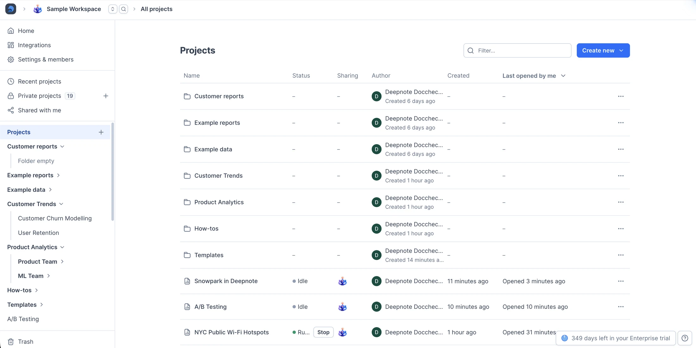
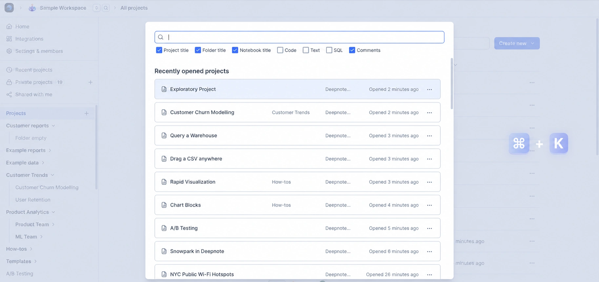
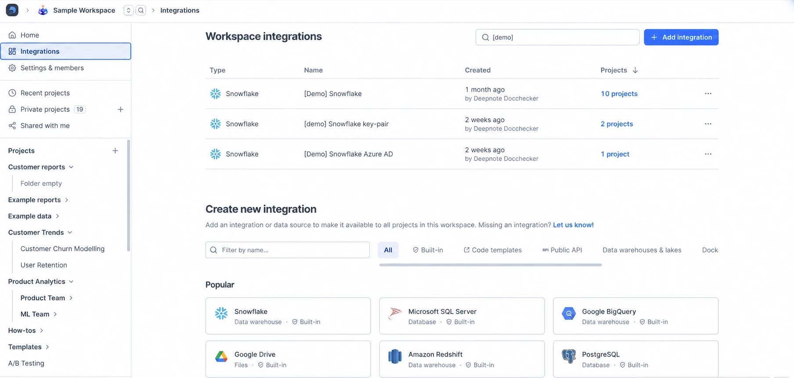

## What can you do with a workspace?

From organizing and searching across projects to managing your team's members and billing details, workspaces are a powerful "control panel" for your team's work. Let's take a look at what you can do within a workspace.

### Organizing projects to suit your workflow

You can create and arrange [projects](/docs/projects) into any logical arrangement you wish, nesting permitted. For example, you may want to organize projects by yearly report cycles, team function, common tasks — or whatever else reflects how your team does business.

### Searching across projects

Using the search (⌘/Ctrl+K), you can search across your entire workspace by project names, notebook names, code, text and more... The search results are displayed in the modal window which you can trigger from anywhere along with helpful project-level metadata, such as location, author and recent activity.

### Managing data connections

Workspaces make it easy to share access to data sources. From the **Integrations** menu in the top left, you can create and edit connections to warehouses, databases, buckets, and other services. Once a service is created, members can connect that service to any project without additional setup — assuming they have the [correct access control](https://deepnote.com/docs/team-permissions).

### Managing members, billing & more

Under **Settings & members** in the top left, you will find controls for inviting and managing members, workspace settings, security features including audit logs and API keys, project settings, AI settings, and billing details and usage.

