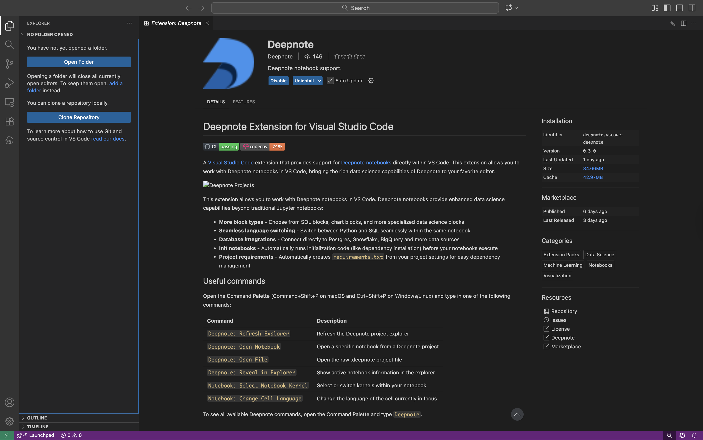

# Getting started with Deepnote in Cursor

Deepnote notebooks can be opened and run locally in your favorite code editor. Whether you use **VS Code**, **Cursor**, or **Windsurf**, the Deepnote extension brings the power of modern notebooks to your local development environment.

**This guide covers using Deepnote in Cursor.** For other editors, see:

- [Getting started with Deepnote in VS Code](../Getting%20started%20with%20Deepnote%20in%20VS%20Code/README.md)
- [Deepnote VS Code Extension Documentation](../../docs/vscode-extension.md)

---

This example demonstrates how to open and run Deepnote notebooks in Cursor using the Deepnote extension. The sample notebook `Housing Prices Prediction.deepnote` creates synthetic housing data and demonstrates data analysis workflows.

## Prerequisites

- **Cursor editor** installed ([download here](https://cursor.sh/))
- **Deepnote extension** installed in Cursor ([download here](https://open-vsx.org/extension/Deepnote/vscode-deepnote))
- **Python environment** (Python 3.8 or higher recommended)
- **Required Python packages**: `numpy`, `pandas`

## Installation

### Step 1: Install the Deepnote extension

Cursor supports VS Code extensions, making it easy to install Deepnote:

**Option A: From extensions marketplace**

1. Open Cursor
2. Click the Extensions icon in the sidebar (or press `Cmd/Ctrl + Shift + X`)
3. Search for "Deepnote"
4. Click **Install** on the Deepnote extension
5. Wait for installation to complete



### Step 2: Verify installation

1. Open Command Palette (`Cmd/Ctrl + Shift + P`)
2. Type "Deepnote"
3. You should see Deepnote-related commands like "Deepnote: Open Notebook"

## Opening the example notebook

### Method 1: Using Cursor UI

1. In Cursor, go to **File → Open Folder...**
2. Navigate to and select `examples/Getting started with Deepnote in Cursor`
3. In the File Explorer, click on `Housing Prices Prediction.deepnote`

### Method 2: Using Terminal

```bash
# Navigate to the example folder
cd examples/Getting\ started\ with\ Deepnote\ in\ Cursor

# Open in Cursor
cursor .
```

Then click on `Housing Prices Prediction.deepnote` in the File Explorer.

### If the notebook opens as plain text

If the `.deepnote` file opens as raw YAML instead of the notebook interface:

1. Open Command Palette (`Cmd/Ctrl + Shift + P`)
2. Type and select **"Deepnote: Open Notebook"**
3. The file will reload in notebook view

## Running the Notebook

### Understanding the sample notebook

The `Housing Prices Prediction.deepnote` notebook contains:

- **Data generation**: Creates synthetic housing data with 300 entries
- **Features**: Size (sqft), age, bedrooms, bathrooms, distance from city, garage, floor
- **Price calculation**: Realistic pricing model based on multiple factors
- **Data cleaning**: Rounding and formatting for analysis

### Executing Code Blocks

**Run a Single Block:**

- Click the **▶ Play button** next to any code block
- Or place cursor in the block and press `Shift + Enter` (Windows/Linux) or `Shift + Return` (macOS)

**Run All Blocks:**

- Click **Run All** in the notebook toolbar
- This executes all code blocks sequentially

**Clear Outputs:**

- Use the toolbar controls to clear execution results

### Viewing Outputs

The notebook displays rich outputs including:

- **Text output**: Print statements and standard output
- **DataFrames**: Interactive tables with 300 rows of housing data
- **Statistics**: Column statistics, histograms, and data summaries
- **Error messages**: Formatted tracebacks if errors occur

### Example Workflow

1. **Import libraries** (Block 1):

   ```python
   import numpy as np
   import pandas as pd
   from pathlib import Path
   ```

2. **Set random seed** (Block 2):

   ```python
   rng = np.random.default_rng(17)
   ```

3. **Generate data** (Blocks 3-6):
   - Creates 300 synthetic housing records
   - Generates features like size, age, bedrooms, etc.

4. **Calculate prices** (Block 7):
   - Applies realistic pricing model
   - Adds market noise

5. **View results** (Block 8):
   - Displays the complete DataFrame
   - Shows 300 rows × 8 columns

6. **Clean data** (Blocks 9-10):
   - Rounds values for better readability
   - Final formatted output

## Key Features

### IntelliSense and Code Completion

- Auto-completion triggers as you type
- Function signatures with documentation
- Import suggestions
- Manual trigger: `Cmd/Ctrl + Space`

### Debugging Support

- Set breakpoints by clicking in the left margin
- Click "Debug Cell" button
- Step through execution
- Inspect variables

### Variable Explorer

- View all variables in current scope
- Inspect values and types
- See DataFrame shapes
- Access via notebook toolbar or Command Palette → "Deepnote: Show Variables"

### Python Environment

To select your Python interpreter:

1. Open Command Palette (`Cmd/Ctrl + Shift + P`)
2. Type "Python: Select Interpreter"
3. Choose your preferred Python environment

## Troubleshooting

### Notebook Opens as Plain Text

**Solution**: Use Command Palette → "Deepnote: Open Notebook"

### Extension Not Recognized

**Solution**: Reload the window after installing the extension

- Command Palette → "Developer: Reload Window"

### Missing Python Packages

**Solution**: Install required packages

```bash
pip install numpy pandas
```

### Code Block Won't Execute

**Solutions**:

- Ensure Python interpreter is selected
- Check that previous cells have been executed (for dependent code)
- Verify Python environment has required packages

## View Raw YAML Structure

To inspect the underlying `.deepnote` file format:

1. Right-click `Housing Prices Prediction.deepnote` in File Explorer
2. Select **"Open With..."**
3. Choose **"Text Editor"**

This shows the YAML structure with syntax highlighting.

## Next Steps

- Modify the housing data parameters and re-run
- Add your own code blocks for analysis
- Create visualizations with matplotlib or plotly
- Export data to CSV files
- Push to Deepnote.com for cloud execution and sharing

## Additional Resources

- [Deepnote VS Code Extension Documentation](https://deepnote.com/docs/vscode-extension)
- [VS Code Marketplace](https://marketplace.visualstudio.com/items?itemName=Deepnote.vscode-deepnote)
- [Open VSX Registry](https://open-vsx.org/extension/Deepnote/vscode-deepnote)
- [GitHub Repository](https://github.com/deepnote/deepnote-vscode)
- [Deepnote Documentation](https://deepnote.com/docs)
- [Report Issues](https://github.com/deepnote/deepnote-vscode/issues)

---

**Happy coding with Deepnote in Cursor! 🚀**
