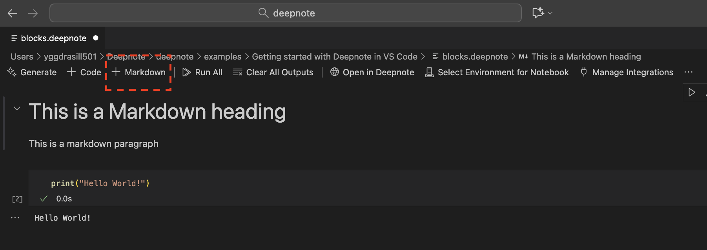
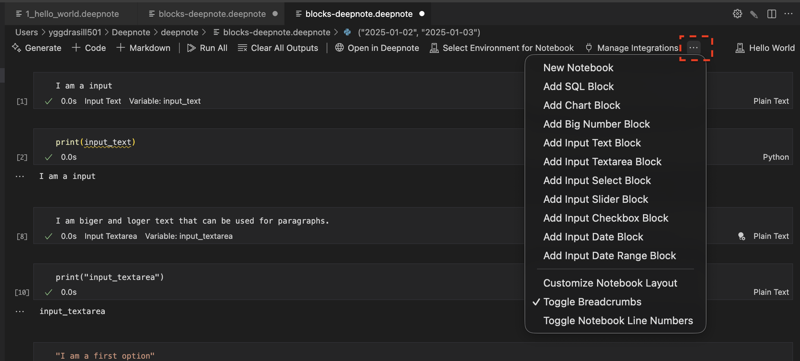
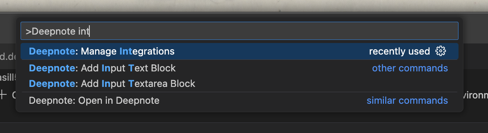
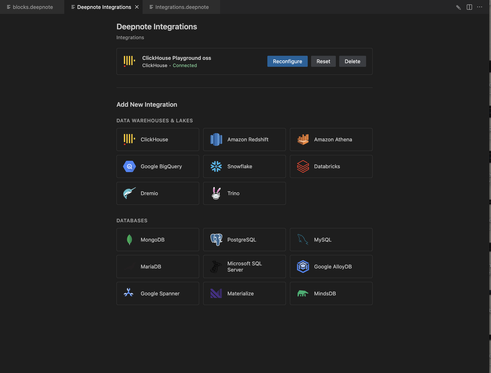

# Examples

This is a guide to get you started with **Deepnote Open Source**, it is just a glimpse of what is possible. To get started just clone this repository.

```bash
git clone https://github.com/deepnote/deepnote.git
cd deepnote
```

As prerequisites, you will need to have [Node.js](https://nodejs.org/) and [Python3.10+](https://www.python.org/downloads/) installed on your system.

## Converting a Jupyter Notebook to Deepnote

Let's start with the simple example, by converting a Jupyter Notebook to a .deepnote file, which is a Deepnote project.

First you will need to install Deepnote converter, by opening a terminal and running this command:

```bash
npm install @deepnote/convert
```

After installing the converter, you can convert a Jupyter Notebook to a .deepnote file by running this command:

```bash
deepnote-convert your_notebook.ipynb
```

## Opening a Deepnote Project

To open a `.deepnote` project, you can use multiple ways, opening in your favorite editor [VSCode](https://code.visualstudio.com/), [Cursor](https://cursor.dev/), or [Windsurf](https://windsurf.com/), reading it in [JupyterLab](https://jupyter.org/), or opening it in [Deepnote Cloud](https://deepnote.com/).

For this example, we will use VS Code, but the steps are same for Cursor and Windsurf.

1. First install VS Code if you haven't already.
2. Open the folder where you cloned the repository. Or simply run `code .` in the terminal.
3. Then install the [Deepnote extension for VS Code](https://marketplace.visualstudio.com/items?itemName=Deepnote.vscode-deepnote) (or [Deepnote extension for Cursor/Windsurf](https://open-vsx.org/extension/Deepnote/vscode-deepnote)) by navigating to Extensions in the left sidebar and searching for `Deepnote` or press `Cmd+Shift+X` on Mac or `Ctrl+Shift+X` on Windows and search for `Deepnote`, and click on `Install`.
4. Then click on the Deepnote icon in the left sidebar, you will see a list of projects on the left sidebar.
5. Open by clicking on the project, and opening `1. Hello World - example`.

## Running a Deepnote Project

To run a Deepnote project, you can use any of the ways mentioned above (except JupyterLab, which is currently read-only).

To run this example, follow these steps:

1. To run the block, click the `Run` button or press `Cmd+Enter` on Mac or `Ctrl+Enter` on Windows.
2. If it is your first time running the block, you will be prompted to select a kernel so select `Python 3.10` or higher.
3. The code should run and you should see `Hello world!` in the output panel.

## What is possible in Deepnote?

The following examples demonstrate different block types and integrations:

### Markdown and Code Blocks

**Markdown blocks** are added via + Markdown in the top bar. See the `1. Text + code` notebook in [2_blocks.deepnote](./2_blocks.deepnote) for examples.


### Input Blocks

**Input blocks** are added via the three dots on the left of the top bar, or by pressing `Cmd+Shift+P` on Mac or `Ctrl+Shift+P` on Windows and typing `Deepnote: Add "block type"`.


All examples are in the `2. Input blocks` notebook in [2_blocks.deepnote](./2_blocks.deepnote):

- **Input Text** - short text inputs for text fields
- **Input Textarea** - long text inputs for multiline text
- **Input Select** - select dropdowns (use the settings icon to add/change options)
- **Input Slider** - slider inputs (configure min, max, step values)
- **Input Checkbox** - checkbox inputs (click checked/unchecked to toggle)
- **Input Date** - date picker inputs
- **Input Date Range** - date range inputs with start and end dates

### Integrations

**Integrations** are added via the top bar by clicking on `Manage Integrations`.


Or by pressing `Cmd+Shift+P` on Mac or `Ctrl+Shift+P` on Windows and typing `Deepnote: Manage Integrations`.


This opens the Deepnote Integrations page where you can add integrations or manage existing integrations.


For example, see [3_integrations.deepnote](./3_integrations.deepnote) which includes a [ClickHouse playground](https://clickhouse.com/docs/getting-started/playground) integration that is free to use. To set it up, use these credentials:

- Host: `play.clickhouse.com`
- Port: `443`
- Database: `default`
- Username: `play`
- Password: `******`

## What's next?

You can have a look at the other examples in this folder:

- `1_hello_world.deepnote` - Simple hello world example
- `2_blocks.deepnote` - Examples of different block types
- `3_integrations.deepnote` - Example with database integrations
- `housing_price_prediction.deepnote` - Real-world ML example with data analysis and model building
